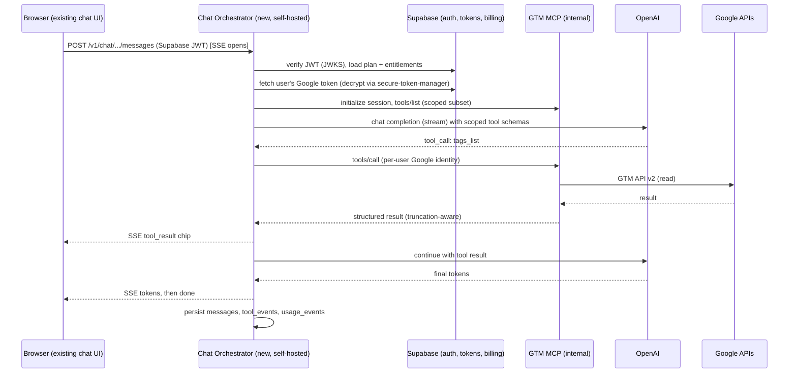
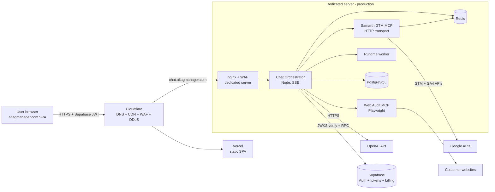
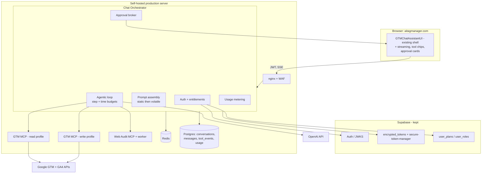

# Samarth Analytics MCP into AI Tag Manager

## Technical Architecture and Feasibility Report

| | |
|---|---|
| **Prepared for** | Samarth Analytics, AI Tag Manager (https://aitagmanager.com) |
| **Subject** | Integrating the Samarth Analytics MCP into the live AI Tag Manager platform, first feature: the GTM AI Chat Assistant |
| **Date** | 5 August 2026 |
| **Status** | For engineering planning, infrastructure design, and production deployment |
| **Sources analyzed** | `samarth-analytics-mcp` (npm `samarth-gtm-mcp` v1.450.8, working copy) and `gtm-ai-automator` (the live AI Tag Manager platform, read from the repository and a supplied archive), plus the live site. Platform database facts are derived from the 146 migration files and the generated types in that repository, not from a live connection to its Supabase project (`aujpsdjoomykwklvtcza`), which this analysis did not have access to. The repository's own audit notes roughly 120 remote-only migrations applied outside version control, so treat the schema described here as the committed schema rather than a guaranteed match for production. |

---

## Executive Summary

**Recommendation: proceed, with a short remediation phase first.**

The integration is technically feasible with high confidence. It is an assembly and hardening project rather than a research project, because the difficult parts already exist and are tested: a working agentic GTM chat (in the monorepo's Electron app), 173 GTM and GA4 tools with default-off write guardrails, 7 curated expert prompts, a Consent Mode v2 engine with a 170-case test suite, and a fully specified production architecture with a reversible cutover runbook.

**What changes for users.** Today the platform's assistant runs a single blocking `gpt-4o` call with no tools, no streaming, no memory across a page refresh, and keyword-matching retrieval. It cannot see the user's container. After integration it reads live GTM and GA4 state, runs curated workflows (audit, debug a non-firing tag, build a GA4 event tag, set up server-side GTM, install an ecommerce funnel), and proposes changes that a human approves before anything is written.

**The one architectural decision.** The MCP server sets no CORS headers, holds sessions in process memory, and drives multi-minute tool loops, so it cannot be called from a browser and does not belong in Supabase Edge Functions. A persistent **chat orchestrator** service is required. It is the only public surface, it enforces identity, entitlements, budgets, and approvals, and most of its internals are ported from the desktop app rather than written from scratch. The chat brain is unusually portable: the loop, tools, prompts, and shared helpers import neither Electron nor the filesystem, and there is no LLM SDK to re-vendor.

**Preferred deployment: self-hosted dedicated server, and the numbers support it.** For this steady, compute-bound workload a roughly USD 80-130/month dedicated machine matches USD 400-800/month of equivalent always-on hyperscaler compute. Monthly infrastructure lands near ₹15,000 at low traffic, ₹30,000 at medium, and ₹1 lakh at high traffic. Keep Vercel for the SPA and Supabase for auth, billing, and user data in Phase 1.

**The 4x pricing model works, and break-even is low.** At roughly ₹4 of token cost per chat turn and a 2:8 markup, gross margin is about ₹12 per turn, so **about 1,300 turns a month (43 a day) covers the entire self-hosted stack**, somewhere between 40 and 90 regularly active chat users. Net contribution runs about ₹15,000-37,000/month at low traffic and ₹2.6-4.9 lakh at medium, where one month roughly pays back the whole build. The more consequential decision is not the multiple but the unit: **price per action, not per raw token.** A single question triggers 5 to 8 model calls, per-turn cost varies about 40x between a definitional question and a container audit, and per-token pricing turns every cost optimization into an equal revenue cut. A weighted credit model (simple chat 1, tool-using turn 2-3, audit 10), each class priced at 4x its own measured cost, keeps the margin and makes optimization pure profit. This promotes usage metering from a cost control to billing infrastructure, and it means server-side entitlement enforcement and a working Stripe state machine are revenue prerequisites, not cleanup.

**What must be fixed before launch, not after.** Five gaps in the current platform would turn an agentic assistant into a liability:

1. The Python Cloud Run service is deployed with no authentication, has no SSRF protection on its URL scanner, and exposes an `/inject` route that accepts a Google access token in the request body and writes to the GTM API. This is the highest-severity finding in either codebase.
2. There is no rate limiting on any AI or GTM endpoint (limiters exist only inside eight admin functions as per-isolate in-memory maps).
3. Plan entitlements are enforced only in the browser; every Edge Function accepts any valid JWT.
4. Stripe webhook handling is a no-op, so `user_plans` is never updated and its usage limits are never read.
5. GTM writes have no dry run, no preview, no snapshot, and no rollback, and failures return HTTP 200 with `success: false`.

Separately, one live subsystem returns hardcoded fabricated results (a fake container id, invented tag counts, an invented compliance score of 94) and writes them to the database as if real, while still being called from three shipping components. It must be removed before anything MCP-branded goes out.

**Effort.** About 63-83 engineer-days total. That is a read-only chat MVP in production in 5-7 weeks solo or 3-4 weeks with two engineers, and a commercially sound version with writes, billing enforcement, and monitoring in 13-17 weeks solo or 7-9 weeks with two. Google's sensitive-scope verification runs on its own clock and should start on day one.

**Top risks** are unbounded LLM cost, unwanted GTM writes, prompt injection through crawled pages and container content, and single-server failure. All four have concrete mitigations in this report: per-turn and per-plan budgets, read-only defaults with human approval and draft workspaces, capability gating with out-of-band confirmation, and continuous WAL archiving with a rehearsed restore onto the staging box.

---

## Contents

1. [Repository Analysis](#1-repository-analysis)
2. [Feasibility Analysis](#2-feasibility-analysis)
3. [Infrastructure Architecture](#3-infrastructure-architecture)
4. [Server Architecture (Production + Staging)](#4-server-architecture-production--staging)
5. [Database Architecture](#5-database-architecture)
6. [GTM AI Chat Architecture](#6-gtm-ai-chat-architecture-the-first-module)
7. [LLM Architecture (OpenAI)](#7-llm-architecture-openai)
8. [API Architecture](#8-api-architecture)
9. [Security Architecture](#9-security-architecture)
10. [Performance Architecture](#10-performance-architecture)
11. [Cost Estimation and Unit Economics](#11-cost-estimation-and-unit-economics)
12. [CI/CD and DevOps](#12-cicd-and-devops)
13. [Monitoring and Observability](#13-monitoring--observability)
14. [Final Recommendation](#14-final-recommendation)

---


---

# 1. Repository Analysis

## 1.0 Scope note

Two codebases matter for this decision, and the request names one of them by a URL that does not resolve to the MCP:

- `github.com/samarthanalytics-sj/gtm-ai-automator` (private) is **AI Tag Manager itself**, the live platform at aitagmanager.com. Confirmed from the ZIP provided and via the GitHub API: `README.md` opens "AI Tag Manager: a SaaS web application by Samarth Analytics that automates Google Tag Manager (GTM) setup from natural-language prompts."
- The **Samarth Analytics MCP** is a different repository, `github.com/samarthanalytics-sj/samarth-analytics-mcp`, which is the working copy this analysis ran against (npm package `samarth-gtm-mcp`, version 1.450.8).

This report therefore analyzes both: the MCP being integrated (1.1-1.5) and the platform receiving it (1.6-1.8).

## 1.1 What the MCP is

A production Model Context Protocol server for the Google Tag Manager API v2 plus GA4 (Admin and Data APIs), shipped as an npm package and a Docker image, published to the MCP registry. Empirically verified by instantiating the server and reading its registered capabilities:

- **173 tools**, of which **52 are read-only** (no `confirm` argument) and **121 are confirm-gated writes**.
- **7 MCP prompts**, which are the curated workflows the planned GTM AI Chat is meant to be "powered by".

Tool distribution:

| Family | Tools | Family | Tools |
|---|---:|---|---:|
| GTM: server-side / advanced (clients, transformations, zones, templates, gtag config) | 29 | GTM: containers + destinations | 12 |
| GTM: folders | 7 | GTM: tags, versions, environments | 6 each |
| GTM: workspaces (incl. publish/preview) | 8 | GTM: triggers, variables, user permissions | 5 each |
| GTM: built-in variables | 4 | GTM: accounts | 2 |
| GTM: audit, export | 1 each | **GTM subtotal** | **97** |
| GA4 Admin (reads, writes across 20 resource types, plus bespoke settings tools) | 73 | GA4 Data (reporting, read-only) | 3 |
| | | **GA4 subtotal** | **76** |

The 7 prompts, which map almost one-to-one onto the chat feature you want:

| Prompt | Purpose |
|---|---|
| `audit` | Resolve account/container/workspace ids, run `audit_container`, summarize findings by severity across 9 categories |
| `debug` | Read-only 5-step diagnostic for a tag that is not firing (tag paused, trigger filters, variables, consent) |
| `create-tag` | 6-step GA4 event tag build: event name, trigger, built-ins, trigger/variable creation, `gaawe` tag, event parameters, verify |
| `report` | Run a GA4 report with correct date handling and cross-check against key events |
| `explain` | Explain a GTM/GA4 concept, or read and explain a specific live resource |
| `setup_server_side_container` | Full sGTM build with corpus-validated resource shapes (FPID client, gtm_client, ed/c/rh variables, sgtmgaaw tags, tagging server URLs) |
| `setup_ecommerce_funnel` | Idempotent GA4 ecommerce funnel install with native ecommerce data, plus Consent Mode v2 defaults on the built-in initialization trigger |

Those prompts encode real GTM expertise (correct enum values, `firingTriggerId` as an array, GA4 event parameters belonging in `eventSettingsTable` rather than the generic parameter list, trigger event names never URL-encoded, resource shapes validated against 562 real container exports). They are the single most valuable asset in this integration, and they are plain strings with a test suite of roughly 50 needle assertions guarding their content.

## 1.2 How the MCP works today

**Transports.** `GTM_MCP_TRANSPORT` selects `stdio` (default, for desktop MCP clients) or `http`. HTTP mode is Express 4 plus the MCP SDK's Streamable HTTP transport, and it is **stateful**: sessions live in an in-process `Map` keyed by `mcp-session-id`, with one `McpServer` instance per session. Routes are `POST/GET/DELETE /mcp`, `GET /health`, the two OAuth discovery documents (RFC 9728 and RFC 8414), and a static mount serving the Stytch authorize UI.

**Authentication, three modes.**

1. Single-identity: ADC, a service-account key, or stored OAuth user credentials in a `0600` token file. Nine Google scopes are requested in one consent (six GTM, three GA4).
2. Static shared bearer token for the HTTP endpoint (`GTM_MCP_HTTP_AUTH_TOKEN`, constant-time compared). This is what the shipped `render.yaml` blueprint deploys.
3. Hosted multi-user: Stytch Connected Apps as the OAuth 2.1 authorization server (ADR-0001, accepted 2026-06-15), with offline JWKS validation pinned to RS256 and a required `exp`, then per-request resolution of that member's Google access token from Stytch, cached in an LRU keyed by (org, member) with the token's own TTL minus 60 s. Per-request identity is carried through `AsyncLocalStorage`, and Google API clients are cached per identity in a `WeakMap`, never as a global singleton.

**Guardrails.** Six environment flags, all defaulting to false and read live on every call: `GTM_MCP_ENABLE_WRITES`, `_PUBLISH`, `_DELETES`, `GA4_MCP_ENABLE_WRITES`, `_DELETES`, plus `DRY_RUN`. Enforcement order matters and is deliberate: a missing `confirm=true` is rejected first, regardless of flags; then the op-type flag; then dry-run short-circuits before any API call. Write tools remain visible in `tools/list` and refuse at call time, and the server describes its own mode in its MCP instructions and `/health` payload.

**Resilience.** Automatic pagination following `nextPageToken` with a 50-page default ceiling and explicit `truncated` + `nextPageToken` on the result. Retries are wired at client construction so they cover every request, but only for GET/HEAD/OPTIONS: mutations must fail loudly exactly once so an ambiguous write is never double-applied. Retry delay is the max of jittered backoff and a parsed `Retry-After` (both the delta-seconds and HTTP-date forms). The GA4 Data client is the single deliberate exception, retrying POST because `runReport` is a pure read. Truncation is surfaced honestly: `audit_container` ORs truncation across five collections, and `export_container` marks itself `incomplete` with "do not use it as a backup."

## 1.3 The rest of the monorepo (all reusable)

| Component | What it is | Relevance to this integration |
|---|---|---|
| `apps/desktop` | Electron app: the **already-working GTM AI chat** with 213 tools, an agentic loop, approvals, memory, corpus grounding, and three LLM providers | The reference implementation. Most of it is portable (see 2.3) |
| `apps/portal` | White-label customer portal: Vite/React client plus Vercel serverless `api/**` routes running capability-aware GTM audits (the audit route alone is 3,752 lines) | Audit engine and evidence discipline are reusable; its stateless signed-cookie session model is not what the platform needs |
| `apps/portal/shared` | Framework-free engines: Consent Mode v2 audit (1,048 lines, 170/170 test suite), audit-accuracy invariants, job state machines, cache + cache-key policy, observability taxonomy, `sa_*` metric catalog, RBAC matrix, retention policy, token-vault seam, web-audit report parser | Drop-in reusable server-side. This is the production plumbing the platform lacks |
| `apps/web-audit-mcp` | Second MCP server: Playwright crawl, form inventory, CMP detection across 16+ vendors, consent scenario capture, Consent Mode v2 compliance audit with a 0-100 score, GTM container reconciliation, tag suggestions, and the gated `verify` engine (7 checks, real form submits, `WEB_AUDIT_ENABLE_VERIFY` off by default) | Directly replaces and exceeds the platform's Python Cloud Run scanner |
| `apps/runtime-worker` | Read-only headless-Chromium capture worker with consent-state presets, shared-secret auth, and an SSRF guard | The runtime-evidence half of audits |
| `apps/mcp-authorize` | Stytch B2B authorize/consent UI, served statically by the MCP server | Only needed if you keep Stytch; the platform already has its own auth |
| `infra/database/0001_init.sql` | 15-table multi-tenant Postgres schema with RLS policies keyed on `app.current_org_id`, a SKIP LOCKED job-queue index, and retention sweep SQL | The AI-plane schema, ready to apply |
| `docs/` | `PRODUCTION_ARCHITECTURE.md` (the intended hosted design), `PRODUCTION_CUTOVER_RUNBOOK.md` (six reversible phases), `OBSERVABILITY.md`, `API_JOBS.md`, `STORAGE_SECURITY.md`, `ARCHITECTURE.md` with a risk register, ADR-0001 | A large amount of the architecture work in this report was already specified here; this report adopts it rather than replacing it |

## 1.4 Dependencies

The MCP server's runtime dependency list is deliberately tiny: `@modelcontextprotocol/sdk`, `express`, `googleapis`, `google-auth-library`, `zod`, `dotenv`. Node >= 18. The desktop chat adds `@googleapis/{tagmanager,analyticsadmin,analyticsdata}`, `cheerio`, and lazy document parsers, and notably **no LLM SDK at all**: every provider call is hand-rolled `fetch` plus SSE parsing. The browser services add only Playwright (as an optional dependency, so the server boots and lists tools without a browser and reports `playwrightAvailable` on `/health`).

Small dependency surface is a real advantage here: porting the chat brain into a web backend introduces almost no new supply chain.

## 1.5 Limitations of the MCP for production multi-tenant deployment

These are the things that must be addressed, not reasons to avoid the integration. Ranked by severity:

1. **Global-identity fallback.** Each HTTP session's server is constructed with the process-global Google auth, and the per-request identity resolver falls back to it whenever the async context is absent. Any path outside the request wrapper would execute as the server's own Google account. Fix: run the hosted MCP with **no** global Google credentials at all, so the fallback is a clean error rather than a privileged identity.
2. **Sessions are not bound to their creator.** The session map is keyed by `mcp-session-id` alone; an id is effectively a bearer capability. Fix: the orchestrator owns session ids server-side and never exposes them to browsers; additionally bind session to user id at creation.
3. **Guardrails are process-wide.** There is no way to grant writes to one tenant and not another. Fix: keep the MCP read-only at the process level and route write operations through a separate write-enabled MCP instance (or a per-request policy layer in the orchestrator that refuses before calling), so entitlements are enforced per user, not per process.
4. **No CORS, by design.** A browser cannot call `/mcp` directly. This is not a defect, it is why an orchestrator tier is mandatory (see 2.2).
5. **No rate limiting, no per-user quota accounting, no structured logs or request correlation.** All three are supplied by the orchestrator plus the shared observability engine.
6. **173 tools is far more than a chat model handles well** in one `tools/list` (schemas alone would dominate the context). The desktop app already solved this with progressive tool-group disclosure; reuse that rather than exposing the flat catalog.
7. **File-based token storage assumes a writable persistent CWD**, which containers do not have. Irrelevant in the hosted path (tokens come from the platform), but it must be consciously disabled.
8. **Operational rough edges** to fix during hosting: the `runtime-worker` Dockerfile omits `url-guard.mjs` from its `COPY` and therefore fails at boot; both browser images use floating `npm install` against a pinned Playwright base image; Stytch issuer/audience pinning is optional and should be mandatory; two GA4 scopes (`analytics.edit`, `analytics.manage.users`) are requested even for read-only deployments and should be dropped from the hosted client; version strings disagree across `package.json`, `server.json`, and the value reported to MCP clients.

## 1.6 The receiving platform: AI Tag Manager as it exists

| Layer | Implementation |
|---|---|
| Frontend | React 18 + TypeScript + Vite 5 (SWC), shadcn/Radix + Tailwind, React Router, TanStack Query, ~44 pages, route-level code splitting, Sentry, DOMPurify. Deployed to Vercel with strong security headers (HSTS preload, `frame-ancestors 'none'`, nosniff, restrictive Permissions-Policy) |
| Backend | Supabase: Postgres 17 (ap-south-1), Auth (Google OAuth), and **133 Deno Edge Functions** |
| Data | ~100 tables. 137 `ENABLE ROW LEVEL SECURITY` statements and 439 policies, with `has_role()` and org-scoping SECURITY DEFINER helpers |
| Scanner | A Python Cloud Run service (Flask + Playwright + OpenAI) with `/scan`, `/generate`, `/inject`, `/health` |
| Admin | IP-allowlisted admin routes via Vercel middleware, MFA enroll/challenge/recovery, AAL2 enforcement, impersonation with dual audit logging, 13 admin functions |
| Live features (per the site) | AI Tag Generator (beta), Ready-to-use Recipes, Google Sheets Importer, App Script Generator |

The platform is substantial and much of it is well built. The relevant question is narrower: what does its chat do today?

## 1.7 The platform's existing chat, precisely

There are three separate "chat" systems and none of them can act:

1. **`gtm-chat-assistant`** is the shipped one. The UI (`src/components/GTMChatAssistantUI.tsx`, ~850 lines) is genuinely production quality: threads, quick prompts, markdown and fenced-code rendering with copy buttons, file upload, paste-JSON-to-diagnose, markdown export. The backend is a single blocking POST to a Deno function using `gpt-4o` at `max_tokens: 2000`. It has **no streaming** (no `stream: true` anywhere in the repo), **no conversation persistence** (threads are React state only, lost on refresh), and **no tool calling**. Its "RAG" splits the user message on whitespace, keeps words longer than three characters, and runs three `ILIKE '%keyword%'` queries against training-data metadata, injecting container name, industry, and requirements text but never the actual container JSON. Container context is three strings taken from session storage, so the assistant never sees the user's real tags, triggers, or variables unless they paste them by hand. The only route to a real change is a manual "Apply Fix" button that hands a JSON block to the direct injector.
2. **`mcp-chat-engine`** is orphaned: its only caller is a component imported by nothing. It writes to `chat_interactions` without a `user_id` while that table's RLS requires `auth.uid() = user_id`, so the rows are unreadable by anyone.
3. **`mcp-automation-engine`** is worse than orphaned. Its "MCP execution" layer returns hardcoded fixtures behind artificial delays (a fake container id, "tagsCreated: 3", "tagsFound: 12, complianceScore: 94"), writes them to `automation_executions` as if real, and is **still called by three live components**. Users can currently be shown invented audit scores. This must be removed or hard-disabled before anything genuinely labelled MCP ships, independent of this project.

So the "MCP" branding already exists in the product surface and is currently theater. The integration replaces theater with the real thing, and there is a clean, well-designed UI shell plus a natural insertion point (the proposal-to-approval seam) waiting for it.

## 1.8 Platform limitations that block a production AI chat

Found with file-level evidence; each is addressed in Sections 2 and 9.

1. **The Cloud Run service has no authentication at all** (deployed `--allow-unauthenticated`, no header check in code; CORS is the only gate and CORS does not stop curl), **no SSRF protection** on `/scan` (so cloud metadata endpoints are reachable through its headless browser with the service's own identity), and an `/inject` route that accepts a Google `accessToken` in the request body and blind-POSTs to the GTM API. This is the highest-severity item in either codebase and is a prerequisite fix, not a nice-to-have.
2. **No rate limiting on any AI or GTM endpoint.** Limiters exist only inside eight `admin-*` functions as per-isolate in-memory maps; the shared helper always returns true; the `rate_limits` table has zero callers.
3. **No server-side plan enforcement.** Entitlement checks live in the browser (`useSubscription`, a wrapper component). Every Edge Function accepts any valid JWT. Combined with (2), an agentic chat over 173 tools would be an unbounded bill.
4. **Billing is decorative.** The Stripe webhook handler verifies signatures correctly and then logs every event to console with "add your logic here." Nothing updates `user_plans`; the `monthly_limit_*` columns are never read.
5. **No write safety on GTM mutations.** No dry run, no diff preview, no pre-change snapshot, no rollback. The injector can auto-publish with a fabricated fingerprint, and failures return HTTP 200 with `success: false`, which will silently mislead any MCP client that checks status codes.
6. **Backend observability is zero.** The shared Sentry, CORS, API-logger, and id-masking helpers have no importers; errors exist only in ephemeral function logs. All 133 functions hardcode a single allowed origin, which breaks `www.` and every preview deployment.
7. **Configuration and crypto fragility.** Three incompatible encryption schemes coexist for token data; one migration warns that anything encrypted under the old placeholder key is now permanently undecryptable; the admin IP allowlist fails **open** to two hardcoded IPs if its env var is unset; a table three services write to has no `CREATE TABLE` in any migration; migration history has drifted (the repo's own audit reports roughly 120 remote-only migrations applied via the dashboard without review).
8. **Duplication and dead paths that will confuse any integration:** seven near-duplicate generator functions, eight Sheets-importer variants, and a multi-LLM orchestrator that advertises seven models across four providers while routing all of them to a function that ignores the provider and hardcodes `gpt-4o-mini`. The correct multi-provider function has no frontend callers.

One thing to note in the platform's favor: `docs/audit-2026-08-03.md` is an honest, file-and-line-referenced self-audit, and several of its findings are already fixed in the current snapshot (the form scanner hardened, SSRF guards added to three crawlers, the hardcoded encryption fallback removed, the MFA recovery route added). Use it as the existing backlog rather than re-deriving one.


---

# 2. Feasibility Analysis

## 2.1 Verdict

**Technically feasible, with high confidence.** The integration is not research; it is assembly plus hardening. Three facts drive that conclusion:

1. The hard part is already built and running. The Electron desktop app in the MCP monorepo is a working GTM AI chat: an agentic tool loop over 213 tools, streaming, an approval ladder, per-client memory, corpus grounding, prompt-cache-aware prompt assembly, and progressive tool disclosure to keep schema tokens under control. It is not a prototype; it ships.
2. That chat brain is unusually portable. An audit of the chat pipeline found that `main/llm/*`, `main/tools/*`, `main/corpus/*`, `main/services/chat-service.ts`, and all of `shared/*` import neither `electron` nor `node:fs`. The Electron coupling is confined to four IPC files, one 21-line encryption adapter, the local JSON stores, and the React renderer. There is also no LLM SDK to re-vendor: provider calls are plain `fetch` plus SSE.
3. The receiving platform already has the surrounding pieces: authentication, a Postgres with disciplined RLS, an admin and RBAC stack, a good chat UI shell, and a natural proposal-to-approval seam in that UI where tool calls belong.

The risk in this project is not "can it work." It is that the platform's current production posture (no rate limits, no server-side entitlements, decorative billing, an unauthenticated scanner service, no write safety) makes an agentic assistant with 173 tools dangerous and expensive if it is bolted on before those gaps close. That is why Section 14's roadmap starts with a short remediation phase.

## 2.2 The one architectural decision that follows from the code

**The MCP cannot be called from the browser, and it should not be hosted inside Supabase Edge Functions.** Three independent constraints force a new backend tier:

- The MCP HTTP transport sets no CORS headers at all, so a browser cannot reach `/mcp` and cannot read the `mcp-session-id` response header.
- MCP HTTP sessions are stateful and held in process memory, with one server instance per session. Deno Edge Functions are short-lived, horizontally replicated, and stateless; there is nowhere to keep a session.
- An agentic turn is a loop of LLM call, tool call, LLM call, often for 30 to 90 seconds, with a streaming response held open. That is the opposite of the serverless execution model, and it is exactly why the audit workers are documented as "never Vercel."

So the architecture is: browser -> **chat orchestrator** (persistent Node service, self-hosted) -> MCP servers (internal, never public) -> Google APIs. The orchestrator is the only new service you must write, and most of its internals are ported rather than authored.



For a write, the orchestrator emits an `approval_required` event instead of executing, the UI renders the existing approval card with editable arguments, and execution resumes only after an explicit user decision. That is the desktop app's model, and it is the correct one for a multi-tenant product.

## 2.3 What can be reused as-is

Ranked by value. "As-is" means no logic change, only dependency injection at the edges.

| # | Module | Why it matters | Change needed |
|---|---|---|---|
| 1 | The 7 MCP prompts plus `gtm-methodology.ts`, `gtm-prompt-sections.ts`, `jit-reference.ts` | The domain brain. This is the actual product differentiator and it is plain strings with tests | None |
| 2 | Tool registry (~213 tools) with approval ladder, argument validation and tool-redirect, idempotency prechecks | The largest single asset; months of work | Inject services instead of local ones |
| 3 | Agentic loop (`gateway.ts`) with step budgets, identical-write blocking, no-op-write detection, abort handling | Prevents runaway loops, which is a cost and safety control | None |
| 4 | Progressive tool-group disclosure (`tool-groups.ts`) | Turns 173 tools into a workable 40-tool visible surface (measured: 40 GTM reads, 15 GA4 reads); directly controls token cost | None |
| 5 | OpenAI client plus SSE transport with rate-limit classification, `Retry-After` honoring, wall-clock budget | Battle-tested, ~400 lines, zero dependencies | Drop the other two providers |
| 6 | `context-budget.ts` (`capToolResult`, `boundChatHistory`) | Structure-preserving truncation with a model-readable partial-result note | None |
| 7 | Chat memory core with secret redaction (9 credential patterns) and ranked retrieval | Per-client memory without leaking tokens into storage or prompts | Swap JSON file store for Postgres |
| 8 | Corpus pattern library (310 KB, 490 containers, k-anonymity floor) plus lookup | Grounding with honest counts, no network, no per-tenant data | None |
| 9 | Consent Mode v2 engine (1,048 lines, 170/170 tests) and the web-audit MCP | Replaces and far exceeds the platform's Python scanner | Host it, do not rewrite it |
| 10 | Shared production plumbing: RBAC matrix, cache and cache-key policy, retention policy, observability taxonomy, `sa_*` metrics, job state machines, `infra/database/0001_init.sql` | Exactly the layer the platform lacks | Wire it (the runbook already sequences this) |
| 11 | Platform side: `GTMChatAssistantUI.tsx`, `_shared/ssrf.ts`, `_shared/validation.ts`, `secure-token-manager`, the admin/MFA/RBAC stack, webhook signature validation | Keep and build on | Extend the UI for streaming and approvals |

## 2.4 What must be redesigned or replaced

| Item | Current state | Action |
|---|---|---|
| `gtm-chat-assistant` Edge Function | Blocking, no tools, no persistence, keyword ILIKE retrieval | Replace with the orchestrator. Keep the function briefly behind a feature flag as fallback, then delete |
| `mcp-chat-engine`, `mcp-automation-engine` | Orphaned; and fabricated results reaching users | Delete `mcp-automation-engine` (or hard-disable and remove its three call sites) before shipping anything MCP-branded. Delete `mcp-chat-engine` |
| `MultiLLMOrchestrator` routing | Advertises 7 models, routes everything to a function that hardcodes `gpt-4o-mini` | Replace with one model registry in the orchestrator (Section 7.1) |
| Cloud Run scanner | Unauthenticated, no SSRF guard, `/inject` accepts a token in the body | Retire in favor of `web-audit-mcp` and `runtime-worker`. If it must live during transition: require auth, port `_shared/ssrf.ts` to Python, and delete `/inject` outright |
| Chat persistence | React state only; `chat_interactions` unusable (inserts omit `user_id` under a `user_id` RLS policy) | New `conversations` / `messages` / `tool_events` tables in the AI-plane database (Section 5.1) |
| GTM write path | No dry run, no preview, no snapshot, no rollback; HTTP 200 on failure | Route writes through the MCP's guardrails plus the approval ladder; default to draft workspaces; correct status codes; record every call in `tool_events` |
| Rate limiting and entitlements | Effectively absent server-side | Orchestrator-owned, Redis-backed, plan-aware (Section 8.4) |
| Billing | Stripe webhook is a no-op | Implement the subscription state machine and make `user_plans` authoritative. This is a prerequisite for charging for chat |
| Retrieval quality | Keyword ILIKE; pgvector columns exist and are unused | Use the corpus lookup for conventions plus pgvector semantic search over recipes and training data |
| Google OAuth scope handling | Five different scope sets across 11 call sites; signup path omits `access_type=offline`, so those users have no refresh token | Consolidate to one scope constant and one consent flow; add a repair path for users who have no refresh token |

## 2.5 Complexity assessment

| Dimension | Rating | Reason |
|---|---|---|
| Algorithmic/AI complexity | Low | The loop, prompts, and tools exist and are tested |
| Integration complexity | Medium | Two codebases, two clouds, per-user Google identity handoff, streaming through a proxy |
| Infrastructure complexity | Medium | Two servers, containers, Postgres, Redis, queue, monitoring. Standard work, well documented in the monorepo's runbook |
| Security complexity | Medium-High | Multi-tenant token handling, prompt injection, write authority, plus five inherited platform gaps to close first |
| Operational complexity | Medium | Self-hosting means you own uptime, backups, and patching (Sections 4, 5, 13 address this) |
| **Overall** | **Medium** | No unknowns of the "we might not be able to do this" kind |

## 2.6 Estimated development effort

One senior full-stack engineer, comfortable in TypeScript, Node, Docker, and Postgres. Estimates are engineer-days of focused work, not calendar days.

| Workstream | Days | Notes |
|---|---:|---|
| W0. Pre-flight remediation (Cloud Run lockdown or retirement, remove fabricated automation engine, CSP tightening, scope consolidation) | 5-8 | Must precede launch; partly independent of this project |
| W1. Infrastructure bring-up (2 servers, Compose, nginx + WAF, TLS, Cloudflare, Postgres, Redis, base monitoring) | 8-10 | |
| W2. Chat orchestrator (port loop + LLM client + prompt assembly + context budget; SSE API; JWT verification; conversation persistence; metering; rate limits) | 12-15 | The core build |
| W3. MCP hosting and per-user Google identity adapter (HTTP mode, token adapter to the platform's encrypted store, tool-profile scoping, session pinning, read-only and write instances) | 8-10 | |
| W4. Frontend integration (streaming into the existing chat UI, tool-trace chips, approval cards, persisted history, the 7 prompts as slash commands) | 8-10 | Reuses the existing shell |
| W5. Write safety and audit trail (plan/confirm/execute, draft-workspace default, `tool_events`, rollback path, correct status codes) | 6-8 | |
| W6. CI/CD, staging parity, golden-transcript prompt verification | 6-8 | |
| W7. Observability, dashboards, alerting | 4-6 | Wiring an existing design |
| W8. Hardening pass, load test, security review, runbooks | 6-8 | |
| **Total** | **63-83** | |

Calendar translation:

- **Read-only chat MVP in production** (W0 minimal + W1 + W2 + W3 + W4, writes disabled): about **35-45 engineer-days**, so **5-7 weeks solo**, or **3-4 weeks with two engineers**.
- **Full production-grade with writes, billing enforcement, and monitoring**: **63-83 engineer-days**, so **13-17 weeks solo**, or **7-9 weeks with two engineers**.

Add roughly 10-15% if the person doing the work is new to either codebase, and note one external dependency with its own clock: Google's sensitive-scope verification for a public consent screen (brand verification, privacy policy, domain verification, scope justification). It takes days to weeks and is paperwork, not engineering, so start it on day one. The platform already requests these scopes today, so this may already be satisfied; confirm before assuming.

## 2.7 Risks and mitigations

| # | Risk | Likelihood | Impact | Mitigation |
|---|---|---|---|---|
| R1 | Unbounded LLM cost from agentic loops (no meter today) | High | High | Per-turn tool-call and time budgets in the loop; per-plan token budgets; hard caps on free tier; cost dashboard and daily spend alert. Ship metering in the same release as chat, not after |
| R2 | The AI performs an unwanted GTM change | Medium | High | Writes off by default; draft workspaces never published; approval cards with editable arguments; destructive actions two-step; every call in `tool_events`; publish stays behind the MCP publish flag |
| R3 | Prompt injection via crawled pages, container fields, or attachments | Medium | High | Capability gating (the model has no publish tool in a read-only profile), out-of-band approval, delimited untrusted-content blocks, SSRF guard, injection canaries in the staging test suite (Section 9.3) |
| R4 | Google API quota exhaustion affecting all tenants | Medium | Medium | Discovery read cache with stale-while-revalidate, per-tenant fairness limits, quota uplift request, the MCP's existing Retry-After-aware retry on reads |
| R5 | Single production server is a single point of failure | Medium | High | Staging box as warm standby with rehearsed restore (RTO under 2-4 hours), continuous WAL archiving (RPO under 5 minutes), monthly restore drills, then a second node in Phase 2 |
| R6 | Cloud Run service exploited before it is retired | Medium | Critical | Treat as P0: require authentication and delete `/inject` in week 1, before any new surface ships |
| R7 | Inherited platform debt slows delivery (migration drift, duplicate functions, three encryption schemes) | High | Medium | Do not refactor broadly. Touch only what the chat path needs; put the rest in a tracked backlog seeded from the existing self-audit |
| R8 | Users without a refresh token (signup path omitted offline access) fail on token refresh | High | Medium | Detect missing refresh token on connect, prompt a re-consent, one scope constant everywhere |
| R9 | Chromium audit workloads starve the chat path on a shared box | Medium | Medium | Container memory/CPU limits, worker concurrency semaphore, queue with per-tenant fairness, and a separate worker box from the 1,000-user tier |
| R10 | Key-person dependency on one engineer holding the whole design | Medium | Medium | This document plus the runbooks; dashboards-as-code; every deploy reproducible from git |


---

# 3. Infrastructure Architecture

## 3.1 What actually needs to be hosted

The integration adds a new "AI plane" alongside the existing platform. The existing plane (Vercel SPA + Supabase + Cloud Run scanner) keeps running. The new components are:

| Component | Runtime | Resource profile | Why it cannot live in Supabase Edge Functions or Vercel |
|---|---|---|---|
| GTM AI Chat Orchestrator (new) | Node 20+ | CPU-light, long-lived SSE connections, stateful tool loops | Edge/serverless time limits and cold starts break multi-minute tool-calling loops and streaming sessions |
| Samarth GTM MCP server (existing, `src/`) | Node 20+ | CPU-light, ~150-300 MB RSS per instance | Needs a persistent HTTP process with MCP sessions; not a per-request function |
| Web Audit MCP (existing, `apps/web-audit-mcp/`) | Node + Playwright Chromium | CPU/RAM-heavy bursts (0.5-1 vCPU + 400-800 MB per active page) | Headless Chromium is explicitly "not for Vercel"; needs a real browser host |
| Runtime capture worker (existing, `apps/runtime-worker/`) | Node + headless Chromium | Same as above | Same as above |
| PostgreSQL (chat history, tool audit log, usage metering) | Postgres 16/17 | Modest; grows with chat volume | Persistent stateful service |
| Redis (rate limiting, queues, response cache) | Redis 7 | Small (256 MB-1 GB) | Persistent stateful service |
| Reverse proxy + WAF (nginx or Caddy + Coraza/ModSecurity) | native or container | Negligible | Entry point for the self-hosted plane |

The SPA (aitagmanager.com) and Supabase (auth, billing, user data, encrypted Google tokens) are kept as-is in Phase 1. This is deliberate: the fastest safe path is to add the AI plane on your own server and integrate over HTTPS, not to relocate a working auth/billing stack on day one.

## 3.2 Preferred design: self-hosted dedicated server

Phase 1 topology (single production box, Docker Compose):



Key properties:

- One public entry point (nginx) with TLS 1.3, HTTP/2, rate limits, and a WAF ruleset; everything else on a private Docker network, no published ports.
- Cloudflare (free or Pro) in front of both Vercel and the dedicated server: DDoS absorption, bot filtering, and hiding the origin IP.
- The MCP servers are never exposed to the public internet directly. Only the orchestrator (and an internal admin path) can reach them.
- Chromium workloads (web audit, runtime worker, verify) run with hard concurrency caps and cgroup memory limits so a burst of scans cannot starve the chat path.
- Staging is a second, smaller machine with the same compose file and different env, so a deployment is proven on identical software before production.

## 3.3 Deployment option comparison

Scores: 1 (weak) to 5 (strong), for this specific workload (persistent Node services + headless Chromium + Postgres, moderate traffic, cost-sensitive).

| Criterion | Dedicated server (preferred) | VPS | Google Cloud | AWS | Azure |
|---|---|---|---|---|---|
| Performance (raw CPU/RAM per dollar) | 5 | 4 | 3 | 3 | 3 |
| Cost at steady load | 5 | 4 | 2 | 2 | 2 |
| Scalability (elastic burst) | 2 | 3 | 5 | 5 | 5 |
| Security (managed primitives available) | 3 (you build it) | 3 | 5 | 5 | 5 |
| Ease of maintenance | 3 | 3 | 4 | 4 | 4 |
| Reliability / SLA | 3 (single box unless doubled) | 3 | 5 | 5 | 5 |
| Future expansion (managed DB, queues, GPUs) | 3 | 3 | 5 | 5 | 4 |

Reading the table honestly:

- Dedicated wins decisively on price/performance. A ~USD 70-130/month machine (e.g. Hetzner AX-class: 8-16 modern cores, 64-128 GB RAM, NVMe) matches USD 400-800/month of equivalent always-on cloud compute. Chromium workloads especially benefit from real cores and local NVMe.
- Cloud wins on elasticity and managed services. You pay roughly 3-5x for that. At your current stage (chat + audits, hundreds to low thousands of users), the load is steady and predictable, which is exactly the profile where dedicated hardware is the right call.
- VPS is the right shape for staging and for the first production months if you want an even lower entry cost; the ceiling is shared/virtualized CPU under Chromium load.
- Reliability gap of a single dedicated box is real. It is mitigated in Section 4 (two independent environments, restorable within an hour) and closed later by adding a second production node behind the load balancer when revenue justifies it.

Region note: the platform's existing Cloud Run worker runs in asia-south1 (Mumbai) and Supabase in ap-south-1. For the dedicated server, choose a location by audience latency to the chat endpoint. Practical options: OVHcloud Mumbai (keeps everything in-region), or Hetzner Germany/Finland (best price, ~110-140 ms from India, acceptable for SSE chat since LLM inference latency dominates). OpenAI and Google API latency is comparable from both.

## 3.4 Recommendation

1. Production: one dedicated server (see sizing in Section 10), Docker Compose, nginx + WAF, Cloudflare in front. Preferred: Hetzner AX line or OVHcloud Advance line; both offer unmetered/high-allowance bandwidth and DDoS protection at no extra cost.
2. Staging/backup: one mid-range VPS or a second smaller dedicated box, same stack, plus the off-site backup target (Section 5).
3. Keep Vercel for the SPA and Supabase for auth/billing/tokens in Phase 1. Revisit full self-hosting of those in Phase 3 only if there is a concrete driver (cost, data residency, or vendor risk); Supabase is open source and has a documented self-host path, so this door stays open.
4. Do not adopt Kubernetes now. Compose on one or two boxes is operable by one engineer; Kubernetes becomes worthwhile at the multi-node worker fleet stage (Section 10, 10k+ users).


---

# 4. Server Architecture (Production + Staging)

## 4.1 Production server

One dedicated machine (Phase 1), Docker Compose project `ata-prod`, Ubuntu 24.04 LTS, everything on an internal Docker network with nginx as the only public listener.

| Service | Image / source | Exposed | Notes |
|---|---|---|---|
| nginx (+ WAF module) | official + Coraza/ModSecurity | 80/443 public | TLS 1.3, HTTP/2, SSE-safe timeouts, rate limits |
| chat-orchestrator | new, from MCP monorepo | via nginx `chat.aitagmanager.com` | SSE chat API, OpenAI calls, approval flow, metering |
| gtm-mcp | existing `src/` server, `GTM_MCP_TRANSPORT=http` | internal only | Per-user Google identity via token adapter; static bearer between orchestrator and MCP |
| web-audit-mcp | existing Dockerfile (Playwright base) | internal only | `WEB_AUDIT_HTTP_AUTH_TOKEN` set; allowlist per job; `--shm-size=1g` |
| runtime-worker | existing (after the COPY fix) | internal only | `RUNTIME_WORKER_TOKEN` set; queue mode later |
| postgres | postgres:17 | internal only | AI-plane data (chat, jobs, audit history, usage) |
| redis | redis:7 | internal only | Rate limits, queues, cache, approval hand-off |
| prometheus + grafana + loki | official | via nginx, auth-protected `ops.` vhost | Section 13 |
| uptime-kuma | official | ops vhost | External + internal checks |

Stays where it is today: aitagmanager.com SPA on Vercel; Supabase (auth, billing, user data, encrypted Google tokens, existing Edge Functions); the existing Cloud Run scanner until its jobs migrate to the self-hosted workers.

Host hardening baseline: SSH keys only + non-standard port or tailnet, UFW default-deny, fail2ban/CrowdSec, unattended security upgrades, Docker socket not exposed, per-container `mem_limit`/`cpus`, LUKS on data volumes, NTP, auditd.

## 4.2 Staging / backup server

A smaller machine running the identical compose file with staging env:

- Purpose mapping to your requirements: feature development and testing (deploy every `main` merge), prompt verification (see below), MCP testing (MCP Inspector + the repo's smoke suites against a dedicated test GTM account and GA4 property), database testing (migrations rehearse here first), deployment validation (same images by digest), rollback support (previous digests retained), backup restoration (monthly restore drill target).
- Its own Supabase staging project (or Supabase branch DB) and its own Google OAuth client in test mode, so no production tokens or user data ever exist on staging.
- Prompt verification workflow: a golden-transcript harness in CI runs a fixed set of chat scenarios (create tag, debug tag, audit summary, sGTM setup) against staging with a mock or sandbox container, asserting tool-call sequences and key assertions in outputs; the MCP repo's existing prompt tests (needle assertions on all 7 registered prompts) run in unit CI. Prompt changes ship like code: PR, staging run, diff of transcripts, then promote.
- Doubles as the warm-standby: production off-site backups restore onto it, which is exactly the monthly drill, so recovery is a rehearsed path, not a hope (RTO target in Section 5.6).

## 4.3 Synchronization between environments

- Code and images: promoted only through CI (Section 12); staging and production never receive rsync'd or hand-edited code. Production runs the exact image digests staging validated.
- Configuration: one `compose.yaml` in git; per-env `.env` rendered from a committed template with env-specific values; a CI check diffs the rendered config of both environments so drift is visible (only intended keys may differ: domains, secrets, sizes, flags).
- Secrets: separate values per environment in the secrets store (Section 9.4); staging never holds production secrets, most importantly Google OAuth client secrets, Supabase service-role keys, and OpenAI keys (separate OpenAI project key for staging, with its own low budget cap).
- Database schema: migrations flow git -> staging -> production. Never copy production schema or data down ad hoc.
- Data: monthly anonymized subset refresh from production backups to staging (emails hashed, tokens dropped, chat text scrubbed), so staging tests against realistic shapes without holding personal data.
- Guardrail parity: the MCP guardrail flags are part of the tracked env template; production write-enablement is an explicit reviewed change, never a hotfix on the box.


---

# 5. Database Architecture

## 5.1 Two databases, one system of record each

| Database | Where | System of record for | Why it stays / exists |
|---|---|---|---|
| Platform DB (existing) | Supabase Postgres 17 (managed) | Users, roles, profiles, plans/billing (Stripe), encrypted Google OAuth tokens, GTM training data + recipes, admin/security events, feature flags | 146 migrations of working auth/billing/admin; RLS already enforced; rewriting it adds risk with no user value |
| AI-plane DB (new) | Self-hosted Postgres 17 on the production server | Conversations, messages, tool-call audit log, audit runs and findings history, worker jobs, runtime capture metadata, usage/token metering | High-volume, latency-sensitive, sits next to the orchestrator; keeps chat load off the platform DB; honors the self-hosted preference |

The MCP monorepo already ships a production schema for exactly this tier: `infra/database/0001_init.sql` (organizations, users, memberships, oauth_connections holding only a `token_ref` and never token bytes, gtm/ga4 snapshot tables, projects, audit_runs, audit_findings, worker_jobs with a SKIP LOCKED dequeue index, runtime_captures with expiry, approval_requests) with row-level security policies keyed on an `app.current_org_id` setting. Adopt it as the base and extend it with the chat tables:

```sql
conversations(id, org_id, user_id, title, product, container_ref, model, created_at, updated_at, archived)
messages(id, conversation_id, role, content, tool_calls jsonb, tokens_in, tokens_out, created_at)
tool_events(id, conversation_id, message_id, tool_name, args_redacted jsonb, result_ref, status, duration_ms, approval_state, created_at)
usage_events(id, org_id, user_id, kind, model, tokens_in, tokens_out, cached_tokens, cost_usd, created_at)
deployments(id, sha, image_digests jsonb, migrations jsonb, deployed_by, deployed_at, rollback_digest)
```

Tenancy: single `org_id` discipline everywhere + RLS, mirroring both the platform DB's RLS style and the monorepo's schema. Even while every org is one user, keeping org-scoping from day one makes the future teams/agency feature a data-model no-op.

## 5.2 Staging database

- Platform side: a separate staging Supabase project (or a Supabase branch database) receiving migrations first.
- AI-plane side: the staging server's own Postgres, migrated by CI before production.
- Refresh policy: Section 4.3 (monthly anonymized subset). Staging never contains real tokens; the token columns are excluded at export time.

## 5.3 Backup strategy

| What | Tool | Frequency | Retention | Destination |
|---|---|---|---|---|
| AI-plane PG: WAL archive (PITR) | pgBackRest (or WAL-G) | continuous | 14 days of WAL + weekly fulls | Off-site object storage (S3-compatible: Storage Box/B2), encrypted |
| AI-plane PG: logical dump | pg_dump custom format | nightly | 30 daily, 12 monthly | Same off-site bucket + staging server |
| Platform DB (Supabase) | Supabase daily backups + PITR add-on | managed | per plan | Supabase |
| Platform DB: independent copy | pg_dump via direct connection | nightly | 30 daily | Your off-site bucket (vendor-independence: your data survives any Supabase account issue) |
| Server config + compose + nginx + dashboards | restic | daily | 90 days | Off-site bucket |
| Secrets store | encrypted export | on change | last 10 versions | Off-site, separately encrypted key |

All backups encrypted client-side (age/repository keys held in the secrets store and printed once to paper for the owner). Backup jobs alert on failure and on "no successful backup in 24h" (absence alerting, not just failure alerting).

## 5.4 Versioning and promotion (staging -> production)

1. Schema changes are migration files in git, reviewed like code.
2. CI applies them to staging automatically on merge; the app runs against the new schema for at least one staging cycle.
3. Production promotion (Section 12.2 stage 3) runs, in order: automatic pre-migration backup checkpoint, expand-phase migrations, deploy, health checks, then contract-phase migrations ship in a later release.
4. Every applied migration is recorded in the `deployments` row for the release, so "what schema is production on" is a query, not archaeology.

## 5.5 Replication and high availability

- Phase 1 (single node): HA is procedural, not topological: PITR with RPO <= 5 minutes (WAL archive interval) and a rehearsed restore to the staging box with RTO <= 60 minutes (DNS flip of `chat.` to staging completes the failover). This is honest and adequate at hundreds of users.
- Phase 2 (from ~10k users or when chat becomes revenue-critical): add a streaming replica on the second box (async, `hot_standby`), promote via pg_ctl or repmgr; put PgBouncer in front (transaction pooling) so failover is a config flip for the app.
- Phase 3 (multi-node fleet): Patroni + etcd for automatic failover, or move the AI-plane DB to a managed Postgres if the ops budget prefers it; the schema and app are unchanged either way.
- Supabase side is managed HA per plan; no action beyond the independent nightly copy.

## 5.6 Disaster recovery and restore procedures

Written runbook (kept next to the compose repo), summarized:

1. Data corruption or bad migration: stop writers -> pgBackRest point-in-time restore to the minute before the event -> replay verified -> restart writers. Target: < 60 min.
2. Production host loss: provision/repurpose staging box -> restore latest full + WAL from off-site -> restore compose + env from restic -> repoint `chat.aitagmanager.com` DNS (Cloudflare, 5 min TTL) -> verify smoke suite. Target: < 2-4 h.
3. Supabase incident: platform reads degrade; chat remains functional for connected sessions (tokens cached), new logins pause; if prolonged, restore the independent dump to the self-hosted PG and point a compatibility layer at it (documented exit path, not automated).
4. Off-site bucket loss: secondary copy of monthlies on the staging box covers it.
5. Drill: monthly restore of the newest backup onto staging with a checksum row-count report; the drill IS the staging data refresh, so it cannot be skipped silently.


---

# 6. GTM AI Chat Architecture (the first module)

## 6.1 Component view



Two MCP instances, not one: a read-only instance with all guardrail flags off, and a write instance with writes enabled but publish and deletes still off. The orchestrator decides which one a given user's turn may reach, based on plan and conversation mode. This gives per-user write authority even though MCP guardrails are process-wide (limitation 1.5.3).

## 6.2 End-to-end workflow

**1. User authentication.** The SPA already holds a Supabase session. Every chat request carries that access token. The orchestrator verifies it offline against Supabase JWKS (issuer and audience pinned, `exp` required), then loads role, plan, and feature flags, cached 60 s in Redis. No user identity is ever taken from the request body.

**2. Google identity for tools.** The orchestrator requests the user's Google access token from the platform's existing `secure-token-manager` path (AES-256-GCM, PBKDF2, fails closed, ignores body-supplied user ids), refreshing via Google when expired and writing the new token back. The token is held only in memory for the duration of the turn, is never logged, never written to the AI-plane database, and never enters a prompt. It is passed to the MCP instance as the per-request identity.

**3. Prompt processing.** Assembly is layered static-first so the prompt cache prefix stays byte-identical across turns: core system prompt, GTM methodology blocks, scoped tool schemas, then session context, retrieved knowledge, memory, rolling history, and finally the user message (Section 7.2). Slash commands map to the MCP's 7 registered prompts, so `/audit`, `/debug`, `/create-tag`, `/report`, `/explain`, plus the sGTM and ecommerce funnel builders are first-class in the UI.

**4. MCP execution.** The orchestrator holds one MCP session per conversation, created lazily and reused across turns (this is why a persistent process is required). Tool schemas are exposed through progressive disclosure: a core group by default, other groups enabled by keyword signal or by the model calling the group-enable tool. Every tool result passes through the structure-preserving truncation helper before it re-enters the model, with an explicit partial-result note so the model never mistakes a truncated list for a complete one.

**5. GTM knowledge retrieval.** Three sources, in order of trust: live container reads through MCP tools (ground truth); the corpus pattern library for naming and convention questions, which always reports real counts and never presents frequency as correctness; and pgvector semantic search over the platform's recipe library and training data, replacing today's keyword ILIKE. Retrieved text is wrapped as untrusted data, never as instructions.

**6. Response generation.** OpenAI streaming, relayed as SSE typed events: `token`, `tool_call_started`, `tool_result`, `approval_required`, `memories`, `retry`, `done`, `error`. The UI renders tool activity as inline chips so the user sees what the assistant is actually doing rather than a spinner.

**7. Writes and approval.** When the model calls a write tool, the orchestrator does not execute it. It emits `approval_required` with a human-readable summary and the parsed arguments, and parks the turn (state in Redis with a TTL so a restart or a second instance can resume it). The UI renders the approval card; the user can edit arguments, approve, or decline. On approval the orchestrator executes against the write MCP instance with `confirm=true`. Destructive operations require the second confirmation step. Publishing is not offered at all in Phase 1: the publish guardrail stays off, and the assistant says so honestly.

**8. Conversation history and context management.** Messages, tool calls, and approvals persist to Postgres with RLS, so history survives refresh (today it does not) and is auditable. The context window is managed by keeping the last N turns verbatim, summarizing older turns with the light model, carrying at most the last few read-only tool results forward, and dropping all carried results as soon as any write lands, because the container just changed.

**9. Error handling.** Typed, in-band, and honest. Google auth expiry produces a reconnect prompt rather than a generic failure; missing scopes produce an actionable re-consent message (the MCP already distinguishes a scope error from an upstream failure); tool failures are reported to the user as failures, never smoothed over by the model; loop-budget exhaustion returns a partial answer plus a continue affordance. Nothing returns HTTP 200 with a hidden failure.

**10. Rate limiting.** Per-user turns per minute and per day by plan, per-org concurrent streams, per-plan job quotas, and a global OpenAI concurrency semaphore, all Redis-backed, with the platform's existing rate-limit override table honored as the admin escape hatch (Section 8.4).

**11. Logging.** One structured JSON line per request and per tool call, with request id, conversation id, and hashed user/org ids for correlation, passed through the shared redaction helper so tokens and PII cannot reach the log pipeline.

**12. Analytics and monitoring.** `usage_events` powers per-user and per-plan cost and adoption reporting; `tool_events` powers tool success rates and latency by family; dashboards and alerts per Section 13. Product analytics worth watching from day one: turns per active user, tool-call rate per turn, approval accept rate (a low rate means the assistant is proposing the wrong things), and time-to-first-token.

## 6.3 Data model for chat

```
conversations (id, org_id, user_id, title, product, container_ref, model, created_at, updated_at, archived)
messages      (id, conversation_id, role, content, tool_calls jsonb, tokens_in, tokens_out, created_at)
tool_events   (id, conversation_id, message_id, tool_name, args_redacted jsonb, result_ref,
               status, duration_ms, approval_state, created_at)
usage_events  (id, org_id, user_id, kind, model, tokens_in, tokens_out, cached_tokens, cost_usd, created_at)
```

RLS on all four, keyed on org, matching both the platform's existing style and the monorepo's schema. Large tool results are stored by reference rather than inline, per the monorepo's storage design.

## 6.4 Phasing within the chat module

- **Phase 1A (MVP, read-only):** streaming chat, container context from live reads, the 5 diagnostic and reporting prompts, history persistence, metering, rate limits. This alone is a large step up from today, because the assistant can finally see the user's actual container.
- **Phase 1B (writes behind approval):** tag/trigger/variable creation into a draft workspace, approval cards, `create-tag` and the ecommerce funnel builder, full audit trail.
- **Phase 1C (audits in chat):** the assistant can launch a site audit or consent scan as a queued job and read the findings back into the conversation, using the web-audit MCP and the Consent Mode v2 engine.
- Deliberately out of Phase 1: publishing containers, the verify engine with real form submits (operator-only, per its existing gating), and any autonomous action without a human decision.


---

# 7. LLM Architecture (OpenAI)

Staying on OpenAI is the right call here: the platform already integrates it, billing is established, and nothing in this design requires provider-specific features beyond function calling, streaming, and prompt caching, all of which OpenAI provides. No provider switch is recommended.

## 7.1 Current state and the first fix

- `supabase/functions/mcp-chat-engine` pins `gpt-4.1-2025-04-14`; the Cloud Run worker documents GPT-4o. Both are superseded generations, and model IDs are scattered across ~10 functions.
- First fix: a single model registry (one config module in the orchestrator, mirrored to a `system_settings` row) mapping task classes to model IDs, so upgrades are one-line changes with an audit trail:

| Task class | Model (August 2026) | Approx. price in/out per 1M tokens | Used for |
|---|---|---|---|
| `chat.default` | GPT-5.4 | ~$2.50 / $15 | Main GTM chat with tool calling |
| `chat.light` | GPT-5.4-mini | ~$0.75 / $4.50 | Title generation, follow-up suggestions, summarizing old turns |
| `route.intent` | GPT-5.4-nano | ~$0.20 / $1.25 | Intent classification, tool-need detection, guard checks |
| `chat.deep` | GPT-5.5 (or GPT-5.6 Sol tier) | ~$5 / $30 | Escalation: multi-container debugging, audit synthesis, complex sGTM design |
| `embed.corpus` | text-embedding-3-small (upgrade path: -large) | ~$0.02 / n.a. | Corpus and recipe semantic search |

Prices move; verify against openai.com/api/pricing at implementation time. The architecture is model-agnostic by design: nothing below depends on a specific model ID.

## 7.2 Prompt architecture

Layered assembly, ordered for prompt-cache hits (static first, volatile last):

1. Core system prompt: role, safety rules, output conventions (no fabricated metrics, GTM enum correctness, confirmation-before-write policy).
2. GTM methodology block: reuse the battle-tested `GTM_CREATION_METHODOLOGY` / `GA4_EVENT_SELECTION` prompts from `apps/desktop/src/shared/gtm-methodology.ts` verbatim; they already encode the tag/trigger/variable creation rules the desktop chat uses.
3. Tool schemas: the MCP tool definitions for the tools enabled for this user/plan (scoped, not the full catalog; see 7.3).
4. Session context: selected GTM account/container/workspace, user plan, feature flags.
5. Retrieved knowledge: corpus patterns and recipe snippets relevant to the current request, wrapped in a clearly delimited data block and treated as untrusted content (prompt-injection defense, Section 9).
6. Conversation window: recent turns verbatim, older turns as a rolling summary.
7. Current user message and attachments.

The MCP server's registered prompts (the "existing MCP prompts" this feature is built on) surface in the UI as slash commands / quick actions; selecting one injects its parameterized template as the user turn, so the same curated workflows work identically in desktop MCP clients and the web chat.

## 7.3 Token and context management

- Context budget per request (default model, 128k window): system + methodology ~3-4k, tool schemas ~4-8k (scoped subset, not all 100+ tools), retrieved knowledge capped at ~2k, history window ~6-10k, output cap 2-4k. Practical steady-state request: 15-25k input tokens.
- Tool scoping is the single biggest token and safety lever: expose only the tool families the conversation needs (mirror the desktop app's product-scoped registry and `CONNECTED_WRITE_ALLOWLIST` pattern instead of registering everything).
- History compaction: keep the last N turns verbatim (N~10), summarize older turns with `chat.light`, store the summary as a conversation attribute. Never resend large tool results; the MCP layer already truncates oversized API responses, and the orchestrator stores full results in Postgres with an ID the model can re-query via a `fetch_result` tool.
- Loop guards: max tool calls per turn (e.g. 12), max wall time per turn (e.g. 90 s), max output tokens per completion; on breach, the orchestrator returns a partial result with a "continue" affordance.

## 7.4 Caching

- OpenAI prompt caching: layers 1-3 above are byte-stable per user session, so cached-input pricing (roughly 50-90% discount on cached tokens depending on model) applies automatically after the first request. This is why static-first ordering matters.
- Application response cache (Redis): idempotent, user-independent asks (recipe explanations, "what is Consent Mode v2", documentation-style answers) keyed by normalized prompt hash, TTL 24 h, bypassed when any tool call is involved.
- Embedding cache: embed each corpus/recipe document once at ingest; embed user queries per request (cheap); cache query embeddings for repeated queries within a session.

## 7.5 Reliability: retries, failover, limits

- Retries: on 429/500/503 and network timeouts, exponential backoff with jitter (0.5 s base, max 3 attempts), honoring `Retry-After`. Never retry non-idempotent tool executions; retry only the LLM completion step.
- Timeout budget: 60 s per completion request, 90 s per full turn; streaming keeps the connection alive so users see progress instead of a spinner.
- Degradation chain (within OpenAI, per the no-other-provider constraint): `chat.deep` -> `chat.default` -> `chat.light` on repeated capacity errors, with a user-visible note; hard failure returns a friendly error plus the conversation preserved.
- Rate limits: track OpenAI `x-ratelimit-*` response headers in metrics; keep a per-org concurrency semaphore (e.g. 8-16 concurrent completions initially) so one burst cannot trip organization-level limits for everyone; request a higher usage tier before launch marketing pushes.
- Failover strategy for a full OpenAI outage: queue non-interactive jobs (audit summaries, batch generation) for later; the chat degrades to tool-only mode (deterministic MCP calls with templated responses) behind a feature flag, which keeps container browsing and audits usable.

## 7.6 Streaming

SSE end to end: OpenAI streaming -> orchestrator -> browser. The orchestrator emits typed events (`token`, `tool_call_started`, `tool_result`, `approval_required`, `done`, `error`) so the UI can render tool-trace chips exactly like the desktop app's chat. WebSockets are not required; SSE traverses proxies and Cloudflare cleanly and is simpler to secure.

## 7.7 Cost optimization summary

A note on how these interact with pricing: under the 4x cost-plus model (Section 11.2), every optimization below is worth four times its face value **only if you price per action rather than per raw token**. Priced per token, each saving cuts revenue at the same rate it cuts cost, leaving margin percentage flat and absolute rupees lower. Section 11.4 makes the case for the credit model; the optimizations are listed here on the assumption you adopt it.

1. Route by task class (table above); never use the deep model by default.
2. Prompt-cache-friendly ordering (already designed in).
3. Tool scoping to shrink schema tokens.
4. History summarization instead of full replay.
5. Response cache for knowledge-style questions.
6. Batch API (50% discount, async) for offline jobs: corpus re-embedding, recipe harvesting, training-data enrichment.
7. Per-plan token budgets metered in Postgres (extend the existing `log-model-usage` pattern), with soft warnings at 80% and hard caps for free tier.
8. Weekly cost report per model/task class from the usage table (Section 13 dashboards).


---

# 8. API Architecture

## 8.1 Gateway topology

nginx on the dedicated server is the API gateway for the AI plane; Supabase remains the gateway for existing platform APIs. One new public API surface:

```
https://chat.aitagmanager.com/v1/
  POST   /chat/conversations                 create conversation
  GET    /chat/conversations?cursor=         list (paginated)
  GET    /chat/conversations/:id             fetch with messages
  POST   /chat/conversations/:id/messages    send message -> SSE stream response
  POST   /chat/approvals/:id                 approve/decline a pending write (edited args allowed)
  GET    /chat/slash-commands                the 7 MCP prompts + platform recipes as commands
  POST   /jobs/audits                        enqueue container/site audit -> 202 {jobId}
  GET    /jobs/:id                           job status/result
  GET    /usage/me                           plan usage + remaining budget
  GET    /health                             liveness (public, shallow)
  GET    /metrics                            Prometheus (internal vhost only)
```

Versioning: URL prefix `/v1`; breaking changes mint `/v2` with a deprecation window; additive changes are non-breaking by contract (clients must ignore unknown fields).

## 8.2 Authentication and authorization

- The SPA authenticates users with Supabase Auth exactly as today. Every call to the AI plane carries the Supabase access token (JWT) in `Authorization: Bearer`.
- The orchestrator validates the JWT offline against Supabase's JWKS (issuer + audience pinned, `exp` required, small clock skew), then resolves plan/role/entitlements from the platform DB with the service-role key over a private, allowlisted connection. Result is cached in Redis for 60 s to keep hot-path latency flat.
- JWT handling rules: access tokens only (never the refresh token, which stays in the Supabase client), 1 h max acceptance regardless of token claims, no session state derived from unverified claims, and org/user ids always taken from the verified token, never from the request body.
- Authorization: the monorepo's RBAC engine (viewer/member/admin/owner permission matrix, deny-before-role ordering, cross-tenant denials mapped to 404) governs conversation and job access; plan entitlements (free/pro/enterprise) gate write tools, audit counts, and model tiers.
- Internal APIs (orchestrator -> gtm-mcp, web-audit-mcp, runtime-worker): private Docker network only, static bearer tokens per service (all three services already implement constant-time bearer checks; the tokens must always be set since each service disables auth when its token is empty), plus per-request user context headers signed by the orchestrator.
- External webhooks: Stripe webhooks stay on the platform (signature-verified, as today); Slack alert webhooks are outbound-only; any future inbound webhook endpoint gets HMAC signatures + replay protection (timestamp + nonce).

## 8.3 Validation and error contract

- Request validation: Zod schemas on every route (both codebases already standardize on Zod), rejecting unknown fields on write endpoints; size caps per route (chat message 32 KB, attachments via separate upload flow with type sniffing).
- Response validation in staging/test builds: responses are checked against the same shared schemas so contract drift fails CI, not production.
- Error contract: `application/problem+json` (RFC 9457) with a stable machine `code` (`auth_expired`, `google_reconsent_required`, `plan_limit_reached`, `rate_limited` + `retryAfter`, `job_timeout`, `tool_failed`, `upstream_quota`), a human message safe to render, and a request id. No stack traces or internal identifiers ever leave the server.
- SSE stream errors are in-band typed events (`error` with the same contract) so the UI can render them inline in the conversation instead of breaking the stream silently.

## 8.4 Rate limiting

Layered, all returning honest `Retry-After`:

1. Cloudflare: coarse IP-level rules and bot filtering before traffic reaches origin.
2. nginx: per-IP request rate + connection caps (`limit_req`/`limit_conn`) tuned to never trigger for normal SPA usage.
3. Orchestrator (Redis token buckets): per-user chat turns/min (e.g. 10), per-user daily turns by plan, per-org concurrent streams (2), per-plan daily job quotas, and the global OpenAI concurrency semaphore. The platform's existing per-user rate-limit override table is honored as the admin escape hatch.

## 8.5 Monitoring, logging, error handling

Per Section 13: every request logs one structured JSON line (request id, user/org hash, route, status, duration) via the shared redacting logger; RED metrics per route; SLO alerts on error rate and latency. 5xx responses page; 4xx anomalies (auth failure spikes, validation error spikes) alert as security signals (Section 9).


---

# 9. Security Architecture

## 9.1 Perimeter and network

- Cloudflare in front of every public hostname: DDoS/DoS absorption (L3/4 and L7), bot management, geo/ASN rules, origin IP concealment (origin firewall allows 443 only from Cloudflare ranges + your admin IPs).
- nginx as reverse proxy with the Coraza (OWASP CRS) WAF: SQLi/XSS/RCE pattern blocking, request size caps, method allowlists per route. WAF in detection mode for two weeks, then blocking with tuned exclusions.
- CrowdSec + fail2ban on the host: SSH, nginx auth failures, and scenario-based bans shared across both servers.
- Private Docker network for everything except nginx; no service port published to the host's public interface; SSH by key only; UFW default-deny; admin/ops vhosts additionally IP-allowlisted (extending the platform's existing admin IP whitelist practice).

## 9.2 Threat-by-threat coverage (your list, mapped to controls)

| Threat | Primary controls |
|---|---|
| DDoS / DoS | Cloudflare absorption; nginx rate/conn limits; queue-based workers so floods cannot spawn Chromium; per-plan quotas |
| Phishing | Strict SPF/DKIM/DMARC (p=reject) on aitagmanager.com; transactional mail via a reputable provider; no credential links in emails; user-visible "we never ask for passwords" policy; admin MFA (already present) |
| SQL injection | Parameterized queries only (supabase-js / pg with placeholders); Zod validation; WAF as backstop; RLS as final containment |
| XSS | React's default escaping; DOMPurify for any rendered HTML/markdown (already a platform dependency); tightened CSP (remove `unsafe-eval`/`unsafe-inline` from script-src via nonces, and remove `api.openai.com` from browser connect-src once all LLM calls are server-side); chat output rendered as markdown text, never `dangerouslySetInnerHTML` |
| CSRF | Bearer-token APIs (no ambient cookie auth on the AI plane); SameSite=Lax on any cookie; state-changing routes require the JWT; webhook endpoints HMAC-verified |
| Prompt injection | See 9.3, it gets its own subsection |
| Jailbreak attempts | System-prompt hardening; write actions gated by out-of-band human approval (UI card, not model text); guardrail flags server-side; refusal + logging of policy-probe patterns; no model-controlled URLs fetched without the SSRF guard |
| API abuse | Layered rate limits (8.4); per-plan quotas; anomaly alerts on usage spikes; API keys (future public API) scoped + revocable |
| Credential theft | Google tokens encrypted at rest (platform already migrated off plaintext columns); token bytes never in logs (redaction helpers in both codebases), never in prompts, never in the browser beyond Supabase session norms; OpenAI keys only server-side in the secrets store; short-lived Google access tokens minted on demand |
| Session hijacking | Supabase JWT short TTL + refresh rotation; IP/device-change heuristics on admin; SSE streams re-validate the token at connect; `Secure`/`HttpOnly` on any cookie |
| Brute force | Supabase auth throttling + CAPTCHA on repeated failures; admin MFA + recovery codes (already built); CrowdSec bans; constant-time compares on internal bearer tokens (already implemented in all three services) |
| Malware | No user-supplied file execution; attachment parsing in a sandboxed worker with type sniffing + size caps; hosts run minimal packages, unattended security updates |
| Ransomware | Immutable/versioned off-site backups (object lock on the bucket), separate credentials for backup writes (append-only), monthly restore drills; ransomware cannot encrypt what it cannot overwrite |
| Bot attacks | Cloudflare bot management + Turnstile on signup/contact forms; honeypot fields; per-IP velocity checks |
| Data leakage | RLS on both databases; tenant-first cache keys; the never-cache list (tokens, captures); redacting logger; chat memory secret-redaction patterns (ported from the desktop store); egress allowlist on workers (SSRF guard already blocks private ranges, metadata IPs, encoded-IP tricks) |
| Unauthorized access | Deny-by-default RBAC with cross-tenant 404s; guardrail flags default-off for writes; approval cards for destructive actions; quarterly access review of admin roles |
| Insider threats | Admin actions audited (platform already logs impersonation, role changes, security events); least-privilege service accounts; separate staging/production secrets; owner-only production secret access; append-only audit tables |

## 9.3 Prompt injection (the AI-specific threat model)

Assume every crawled page, GTM container field, training-data row, and user attachment is adversarial input. Controls, in order of importance:

1. Capability gating beats instruction filtering: the model cannot do damage it has no tool for. Read-only tool profile by default; write tools appear only for entitled plans in write-enabled conversations; deletes/publishes stay behind the MCP guardrail flags plus per-call `confirm` plus a human approval card. A hijacked model still cannot publish a container.
2. Out-of-band confirmation: approval decisions happen in the UI against the actual parsed arguments (editable by the user), never inside model text. The desktop approval ladder (auto-apply drafts / one-card additive / two-step destructive) is adopted as-is.
3. Provenance separation: retrieved corpus/recipes/scan results are wrapped in delimited data blocks with an explicit "content, not instructions" framing; tool results are structured JSON, not freeform text merged into the system prompt.
4. Egress discipline: the model cannot cause requests to arbitrary URLs; scan targets pass the SSRF guard and per-tenant allowlists; no tool fetches a URL found in page content.
5. Injection canaries in staging: the golden-transcript suite includes hostile pages/containers (hidden instructions, fake "system" text) and asserts the assistant neither obeys nor exfiltrates.
6. Everything the model did is reconstructable: `tool_events` records every call, argument set (redacted), and approval state per conversation.

## 9.4 Secrets management

- SOPS + age for the compose repo (secrets encrypted in git, decrypted only on the servers by host keys); or HashiCorp Vault later if secret count grows. Never plaintext `.env` in git (both repos already gitignore correctly).
- Separation per environment; OpenAI staging key with its own low budget; Google OAuth staging client.
- Rotation calendar: internal bearer tokens and session secrets quarterly; OpenAI/Google secrets on personnel change or suspicion; automated rotation is a Phase 3 nicety.
- KMS-backed `Cryptor` implementation for anything the app must decrypt (the desktop's 21-line injectable Cryptor seam ports directly; Google refresh tokens stay in the platform's existing encrypted storage).

## 9.5 Encryption

- In transit: TLS 1.3 everywhere public (Let's Encrypt, auto-renewed, HSTS preload already set); TLS or private-network isolation for internal hops; Postgres `sslmode=require` for any off-box connection.
- At rest: LUKS on server data volumes; Postgres data on encrypted volumes; app-layer AES-GCM for token bytes (existing platform pattern); encrypted backups (age) with keys stored separately from the data.

## 9.6 IAM policies

- Humans: owner (you) + named engineer accounts; no shared logins; MFA mandatory on GitHub, Supabase, Cloudflare, registrar, Google Cloud, OpenAI; hardware key for the owner accounts.
- Services: one least-privilege identity per service (DB roles per service; the MCP's Google access is per-user delegated, never a broad service account); Supabase service-role key only on the orchestrator, never in Edge Functions callable by users, never in the browser.
- Reviews: quarterly access + key inventory review, recorded in the ops log.

## 9.7 Detection: IDS/IPS, audit logging, monitoring

- CrowdSec (network/behavioral IPS) + auditd (host syscall audit on auth-sensitive paths) + Docker bench baseline; Wazuh is the upgrade path if compliance demands a SIEM.
- Application audit trail: platform `security_events` (exists) + AI-plane `tool_events`/`deployments` + admin-action logs; append-only, retained 365 d.
- Security dashboard + alerts per Section 13 (WAF blocks, ban spikes, auth failure spikes, new-location admin logins, token-decrypt failures).

## 9.8 Incident response, backup security, compliance

- One-page IR runbook: severity ladder, first-15-minutes checklist (snapshot logs, revoke suspect tokens, block at Cloudflare), communication templates, and the restore procedures of Section 5.6; tabletop quarterly.
- Backup encryption covered in 9.5/5.3; restore drills monthly; backup credentials append-only.
- Compliance posture: GDPR-first (EEA visitors are in scope): DPAs with OpenAI, Supabase, Vercel, Cloudflare, host; data inventory + retention windows (the monorepo's retention engine encodes them); user deletion cascades (platform already has delete-user cascade migrations + admin export tooling); privacy policy updated for AI processing (chat content sent to OpenAI, no training on your data via API by default); EEA consent alignment is literally the product's own specialty (Consent Mode v2 engine). SOC 2 is a later, sales-driven exercise; this architecture (audit trails, RBAC, encryption, change management) is designed to make that audit a documentation task, not a rebuild.


---

# 10. Performance Architecture

## 10.1 Workload characterization (measured/derived from the codebases)

| Workload | CPU | RAM | Latency profile |
|---|---|---|---|
| Chat turn (orchestrator) | negligible (I/O bound) | ~few MB per active SSE session | Dominated by LLM inference (1-15 s) and tool round trips |
| MCP tool call (GTM/GA4 read) | negligible | shared instance ~150-300 MB RSS | 200-800 ms Google API round trip |
| gtm-mcp HTTP instance | light | one lightweight server object per session; ~150-300 MB per process | n.a. |
| Web audit / compliance scan | ~1 vCPU while active | 1-1.5 GB per in-flight audit (Node + Chromium + heavy pages) | 2-4 min typical, up to ~40 min at max caps |
| Runtime capture | ~1 vCPU | 0.5-1.5 GB | 30 s-few min per request |
| Postgres (AI plane) | light at Low/Medium | 2-8 GB configured | sub-ms local |

Two external ceilings matter more than hardware:

1. Google API quotas are per OAuth client project, shared across all your users. The GTM API's default quota is low (on the order of 10k requests/day and a strict per-minute rate; verify current numbers in the Google console). Production needs: a quota uplift request to Google, the read-cache below, and per-tenant fairness so one heavy user cannot 429 the platform. The MCP layer already retries with Retry-After honoring on reads, which absorbs bursts but not sustained overuse.
2. OpenAI organization rate limits (tier-based TPM/RPM): the per-org concurrency semaphore in Section 7.5 plus usage-tier upgrades are the controls.

## 10.2 Latency and throughput targets (SLOs)

- Time-to-first-token (chat): p95 < 3 s.
- Read tool call end-to-end (shown as a chip in the UI): p95 < 2.5 s.
- Simple chat answer complete: p95 < 12 s.
- Audit job start latency (enqueue -> running): p95 < 30 s at normal load.
- Chat availability: 99.9% monthly (Section 13 alerting; Section 5.6 failover).
- API error rate (5xx): < 0.5% of requests.

## 10.3 Concurrency and queue management

The browser services have no built-in concurrency control (verified: every request launches Chromium unbounded, sequential within a request), so the platform tier must own capacity:

- All scans/audits/captures/verifies are queue jobs, never inline HTTP waits: BullMQ on Redis (or the monorepo's already-designed Postgres `worker_jobs` + `FOR UPDATE SKIP LOCKED` queue; either is fine, pick one and keep it). API returns 202 + job id; UI polls or subscribes.
- Worker semaphore: concurrent jobs per worker box = floor((RAM_GB - 2) / 1.5), also capped at vCPU - 1. A 16 GB/8 vCPU worker runs ~7 concurrent audits safely; Phase 1 single-box production reserves 2-3 slots so chat never competes with Chromium for memory.
- Per-tenant fairness: round-robin dequeue by org, max 2 concurrent jobs per org, per-plan daily job quotas.
- Job hygiene: hard wall-clock kill at 2x expected class duration (audit 10 min default profile, not the 40-min max caps), dead-letter queue with alerting, idempotent retry (jobs are read-only against customer sites).
- Chat tool loop: per-turn budget (max 12 tool calls / 90 s) enforced in the orchestrator, mirroring the desktop gateway's step budgets.

## 10.4 Caching layers (top to bottom)

1. OpenAI prompt cache (Section 7.4): free latency and cost win from static-first prompts.
2. Redis response cache for knowledge-style answers (24 h TTL).
3. GTM/GA4 discovery read cache: adopt the monorepo's cache engine as designed (tenant-first keys `sa:v1:{orgId}:...`, TTL 300 s with stale-while-revalidate for accounts/containers/workspaces lists, 10 s no-SWR for statuses, an explicit never-cache list for tokens and captures). This directly protects the Google quota ceiling.
4. Corpus pattern library: in-process (it is a 310 KB static JSON; zero cost).
5. Postgres: hot indexes below; no query cache needed at this scale.

## 10.5 Load balancing and scale-out path

- Phase 1: nginx alone (single upstream per service). SSE-safe config: `proxy_buffering off`, long `proxy_read_timeout` on chat routes, HTTP/2 to clients.
- Phase 2 (two app nodes): nginx upstream with `ip_hash` or a session-affinity cookie. Two stickiness facts from the code: the gtm-mcp HTTP transport keeps sessions in process memory, and the orchestrator's approval hand-off is in-process unless moved to Redis. Plan: orchestrator instances pin their MCP sessions to a co-located MCP instance (1:1 sidecar pairing), and approvals move to Redis with TTL. Then any orchestrator can serve any user, and only orchestrator->MCP pairing stays sticky.
- Phase 3: workers scale horizontally without any stickiness (queue consumers). DB gains a replica (Section 5.5). k3s becomes worthwhile here.

## 10.6 Database optimization

- Indexes: `messages(conversation_id, created_at)`, `tool_events(conversation_id, created_at)`, `usage_events(org_id, created_at)`, the shipped partial index on `worker_jobs(status)` for SKIP LOCKED, `runtime_captures(expires_at)` for the retention sweep.
- `statement_timeout` set app-side (the monorepo's DB config seam already carries `STATEMENT_TIMEOUT_MS`).
- JSONB for tool args/results with size caps at write time (large results go to object storage with a reference, per the monorepo's design).
- Partition `usage_events` and `messages` by month once they pass ~50M rows (100k-user scale); not before.
- PgBouncer in front of Postgres from Phase 2 (transaction pooling).
- Retention sweeps per the monorepo's retention policy engine (captures 30 d, audit runs 365 d, jobs 30 d, logs 14 d) via pg_cron or a worker cron.

## 10.7 Recommended server specifications by scale

| Scale | Layout | Specs (per box) | Expected headroom |
|---|---|---|---|
| 100 users | 1x production dedicated + 1x staging VPS | Prod: 8 cores / 64 GB / 2x512 GB NVMe RAID1 (AX52-class). Staging: 4 vCPU / 16 GB | 2-3 concurrent audits + all services + monitoring at < 40% utilization |
| 1,000 users | 1x bigger box, or app box + worker box | 16 cores / 128 GB / 2x1 TB NVMe (AX102-class); or 8c/64GB app + 8c/64GB worker | 5-7 concurrent audits, thousands of daily chat turns |
| 10,000 users | 4 boxes: 2x app (HA), 1-2x worker, DB colocated on app pair with streaming replica | App: 8-16c/64GB each. Workers: 16c/128GB each | 10-15 concurrent audits, ~30k chat turns/day, survives one box loss |
| 100,000 users | Fleet: 2-3x app, 4-8x workers, dedicated DB pair + PgBouncer, Redis sentinel; k3s; CDN for all static | Workers sized by queue depth; DB: 16c/128GB NVMe pair | Horizontal on every tier; consider managed DB or a second region at this point |

At every step the constraint to watch is not CPU: it is worker RAM (Chromium), Google API quota, and OpenAI spend. The sizing above keeps hardware roughly one order of magnitude ahead of those ceilings.


---

# 11. Cost Estimation and Unit Economics

All figures are monthly. USD converted at **₹95/USD** (spot was ₹95.4 on 5 August 2026); re-check before setting list prices. Three traffic scenarios are used throughout:

| Scenario | Registered users | Daily active chat users | Chat turns/month | Audits + scans/month |
|---|---|---|---|---|
| Low | ~100-500 | ~10-30 | ~3,000 | ~150 |
| Medium | ~1,000-5,000 | ~100-300 | ~30,000 | ~1,500 |
| High | ~10,000+ | ~1,000+ | ~300,000 | ~15,000 |

## 11.1 OpenAI API usage (the dominant variable cost)

Assumptions: default model at ~$2.50 in / $15 out per 1M tokens; ~20k input tokens per turn of which 60-75% hits cached-input pricing because of the static-first prompt layout; ~1k output tokens per turn; ~10% overhead for light-model tasks (titles, summaries, intent routing).

| | Low | Medium | High |
|---|---|---|---|
| Effective cost per turn | ~$0.03-0.06 (₹2.85-5.70) | ~$0.03-0.06 (₹2.85-5.70) | ~$0.025-0.05 (₹2.40-4.75) |
| Chat total | ~$100-180 (₹9,500-17,100) | ~$1,000-1,800 (₹95,000-171,000) | ~$8,000-15,000 (₹7.6-14.3 lakh) |
| Embeddings + batch jobs | ~$5 | ~$20 | ~$100 |

## 11.2 Unit economics at the 4x pricing model

Your stated model is a 2:8 ratio, so **4x token cost, a 75% gross margin on LLM spend**. Applied to the scenarios above (mid-range cost per turn ≈ ₹4, so price per turn ≈ ₹16, gross margin per turn ≈ ₹12):

| | Low | Medium | High |
|---|---|---|---|
| LLM cost (incl. embeddings) | ₹9,975-17,575 | ₹96,900-172,900 | ₹7.70-14.35 lakh |
| Revenue at 4x | ₹39,900-70,300 | ₹3.88-6.92 lakh | ₹30.8-57.4 lakh |
| Gross LLM margin | ₹29,925-52,725 | ₹2.91-5.19 lakh | ₹23.1-43.0 lakh |
| Infrastructure (Section 11.3) | ₹14,725-16,150 | ₹29,450-31,350 | ₹97,850-1.05 lakh |
| **Net contribution** | **₹15,200-36,575** | **₹2.61-4.87 lakh** | **₹22.1-42.0 lakh** |

Three conclusions follow:

1. **Break-even is very low.** At ~₹12 gross margin per turn against ~₹15,400/month of fixed infrastructure, you cover the entire self-hosted stack at roughly **1,300 chat turns/month**, about 43 turns a day. Depending on how heavily people use it, that is somewhere between 40 and 90 regularly active chat users. The infrastructure decision in Section 3 is not financially risky at any realistic launch volume.
2. **Payback on the build is fast.** Once you are at Medium traffic, one month of net contribution roughly covers the entire 63-83 engineer-day implementation.
3. **Self-hosting matters more at low volume than high.** At Low traffic, infrastructure is ~30% of gross margin; on AWS or Azure it would be closer to 90%, which is the difference between profitable and not. At High traffic infrastructure is under 5% of margin either way, and LLM spend is the only line that matters.

## 11.3 Infrastructure by deployment option

### Option A: Self-hosted dedicated (recommended)

| Item | Low | Medium | High |
|---|---|---|---|
| Compute: production dedicated server | $80 (8c/64GB NVMe class) | $130 (16c/128GB class) | $420 (2x app/DB + 2x worker boxes) |
| Compute: staging server | $25 (VPS 4c/16GB) | $40 (VPS 8c/32GB) | $80 (small dedicated) |
| Storage (extra NVMe/volumes) | incl. | $10 | $40 |
| Database | incl. (same box) | incl. (same box) | incl. (dedicated box above) |
| Backups (off-site: Storage Box / B2, 100GB-2TB) | $5 | $10 | $30 |
| Monitoring + logging (self-hosted Prometheus/Grafana/Loki) | $0 | $0 | incl. (ops box) |
| Sentry (team) | $0 (free tier) | $26 | $80 |
| Bandwidth | incl. (generous/unmetered) | incl. | incl. |
| SSL certificates | $0 (Let's Encrypt) | $0 | $0 |
| Domain | $1 | $1 | $1 |
| Email (Resend/Postmark/SES) | $0-10 | $20 | $50 |
| Security (CrowdSec console, optional) | $0 | $0-30 | $30 |
| CDN + WAF (Cloudflare) | $0 (Free) | $25 (Pro) | $225 (Business) |
| Existing platform kept: Supabase Pro + Vercel Pro | $45 | $45 | $70 |
| **Infra subtotal** | **~$155-170 (₹14,725-16,150)** | **~$310-330 (₹29,450-31,350)** | **~$1,030-1,100 (₹0.98-1.05 lakh)** |

### Option B: VPS only

Same layout on cloud VPSes: Low ~$120-150 infra, Medium ~$250-300, High not recommended (virtualized CPU under Chromium load).

### Option C: Google Cloud

| Item | Low | Medium | High |
|---|---|---|---|
| Compute (VMs/GKE + Cloud Run workers) | $220 | $480 | $2,200 |
| Cloud SQL Postgres (HA) | $120 | $260 | $900 |
| Storage + backups | $15 | $40 | $150 |
| Monitoring/logging ingest | $10 | $60 | $300 |
| Egress bandwidth | $20 | $80 | $500 |
| CDN/LB (Cloud Armor + LB) | $25 | $60 | $250 |
| **Infra subtotal** | **~$410 (₹38,950)** | **~$980 (₹93,100)** | **~$4,300 (₹4.09 lakh)** |

### Option D: AWS

EC2 + ECS + RDS Multi-AZ + ALB + CloudWatch + NAT gateway: Low ~$450-520, Medium ~$1,050-1,250, High ~$4,500-5,500. NAT gateway and egress are the classic surprise lines.

### Option E: Azure

D-series VMs + PostgreSQL Flexible HA + Front Door + Monitor: Low ~$470-550, Medium ~$1,100-1,300, High ~$4,800-6,000.

**Reading:** dedicated is 2.5-4x cheaper than the hyperscalers for this steady, compute-bound workload. In margin terms at Low traffic, that difference is the majority of your net contribution.

## 11.4 The pricing decision that matters more than the markup

**Recommendation: charge per action (a credit model), not per raw token, and treat 4x as the internal floor and a monitored ratio rather than a per-request formula.**

Four reasons, each grounded in how the system actually behaves:

1. **One user question is not one LLM call.** A tool-using turn is typically 5 to 8 model calls (question, tool call, result, continue, final answer). Users count questions; they cannot predict token counts. Per-token invoicing on an agentic product is unexplainable and generates support load.
2. **Per-token pricing turns every optimization against you.** Section 7.7 lists prompt caching, tool scoping, history summarization, and response caching. Together they cut cost per turn substantially. If price is a fixed multiple of tokens consumed, those savings cut your revenue at the same rate: margin percentage stays at 75% while absolute rupees fall. Priced per action, every one of those optimizations is pure margin.
3. **Cost variance per turn is roughly 40x.** "What is Consent Mode v2" costs about ₹1. "Audit my container and propose fixes" with 12 tool calls and a large container export can exceed ₹40. Flat per-turn pricing means light users subsidize heavy ones, which is fine at scale and dangerous with fifty customers. Weighted credits solve this cleanly: simple chat 1 credit, tool-using turn 2-3 credits, container or site audit 10 credits, each class priced at 4x its own measured average cost.
4. **It insulates you from OpenAI price changes and FX.** Your cost is in USD and your price is in INR. At 75% gross margin, a 10% rupee depreciation moves you to roughly 72.5%, which is comfortable. Model price cuts (the trend so far) become margin rather than an automatic discount to customers.

**Cached tokens need an explicit decision.** With static-first prompt ordering, 60-75% of input tokens bill at the cached rate, which is a 50-90% discount. If you 4x your actual billed cost, you stay honestly at 4x and the customer benefits from your engineering. If you 4x list-price token counts, your realized markup on cache-heavy turns is closer to 6-10x, which is defensible as pricing the service rather than the wholesale input but is fragile the moment a technical customer compares against OpenAI's public rates. The credit model sidesteps the argument entirely: you publish a price per action, and the cache saving is yours.

## 11.5 What the 4x model requires from the build

Charging a multiple of cost promotes metering from a cost control to **billing infrastructure**, with the requirements that implies:

- **Idempotent, immutable usage records.** A retried request must never double-charge. `usage_events` rows are append-only and carry a request id as the idempotency key. The schema in Section 5.1 already separates `cached_tokens` so realized markup is computable per turn.
- **Monthly reconciliation** of your recorded totals against OpenAI's own usage reporting, with a variance alert. Unreconciled metering eventually becomes a customer dispute you cannot win.
- **A written policy for failed and aborted turns.** Recommendation: do not bill them. That makes a rising failure rate simultaneously a margin leak and a quality alarm, visible on the same dashboard, which is exactly the incentive you want.
- **Server-side entitlement enforcement, before launch.** At a 4x markup, every free-tier turn is a pure loss, and today entitlement checks live only in the browser (Section 1.8, item 3). That gap stops being merely a security issue and becomes a direct revenue leak. Hard-cap the free tier server-side (for example 20 turns/month) in the same release as chat.
- **A realized-ratio dashboard, not just a cost dashboard.** Track revenue divided by LLM cost per plan, weekly. Alert if it falls below about 3x, which signals either a heavy-user cohort eroding the blend or a model price change that has not been passed into your credit pricing.
- **Working billing.** The Stripe webhook handler is currently a no-op (Section 1.8, item 4), so `user_plans` is never updated. Nothing in this pricing model functions until that state machine exists. It belongs in Phase P5 at the latest, and arguably earlier, since it gates revenue.


---

# 12. CI/CD and DevOps

## 12.1 Repositories and branching

Two repos stay separate on purpose: `gtm-ai-automator` (platform: SPA + Supabase functions/migrations) and `samarth-analytics-mcp` (MCP monorepo: MCP server, orchestrator, web-audit, worker). The MCP repo already uses Conventional Commits + semantic-release; adopt the same convention in the platform repo.

Branching: trunk-based.

- `main` = always releasable; every merge auto-deploys to staging.
- Short-lived feature branches -> PR -> review -> squash merge.
- Production deploys from tags (`vX.Y.Z`, cut by semantic-release in the MCP repo; manual tag or release PR in the platform repo).
- Hotfix: branch from the production tag, fix, tag, deploy, merge back to `main`.

## 12.2 Pipeline (GitHub Actions)

Stage 1: CI on every PR

- MCP repo: `npm run typecheck`, `npm test` (the repo's full suite, including the 170/170 consent suite and guardrail tests), `npm run webaudit:check`, Docker build of changed services.
- Platform repo: `npm run lint`, `vite build`, Deno tests for Edge Functions, `supabase db diff` check so schema drift is visible in review.
- Secret scanning (gitleaks) and dependency audit (npm audit + Dependabot/Renovate PRs).

Stage 2: staging deploy (auto, on merge to `main`)

- Build Docker images (orchestrator, gtm-mcp, web-audit-mcp, runtime-worker), tag with git SHA, push to GHCR.
- SSH to staging: `docker compose pull && docker compose up -d --wait`, then run DB migrations (expand-only, see 12.3), then the smoke suite (`npm run smoke` exercises the MCP tool surface; add an orchestrator smoke: login -> chat turn -> tool call -> stream completes).
- Platform side: Vercel preview/staging deployment + `supabase db push` and function deploys against the staging Supabase project.

Stage 3: production deploy (manual approval on the tag)

- GitHub Environment `production` with required reviewer (you).
- Same compose pull on the production host, images promoted by digest (exactly what staging ran, no rebuild).
- Ordered: migrations (expand phase) -> new containers -> health checks green -> traffic stays on nginx throughout (rolling per-service restart; the orchestrator drains SSE connections on SIGTERM with a 30 s grace).
- Post-deploy verification: automated smoke + 15 min of dashboard watch (error rate, TTFT, tool failure rate) before closing the deploy.

## 12.3 Database migrations and rollback

- Expand-contract discipline: deploy N adds columns/tables (backward compatible), deploy N+1 removes old paths. Never a destructive migration in the same release that starts using the new shape.
- Platform DB: Supabase CLI migrations (already 146 in-repo) applied to staging first, production on approval.
- AI-plane Postgres: node-pg-migrate (or Prisma Migrate) with the same discipline; migration files reviewed like code.
- Rollback strategy, in order of preference: (1) roll forward with a fix; (2) redeploy previous image digest (safe because expand-contract keeps old code compatible with new schema); (3) restore from PITR (Section 5) only for data corruption, never for code bugs.
- Every release records: git SHA, image digests, migration IDs, deployer, and the rollback digest, in a `deployments` table row (this doubles as the audit trail).

## 12.4 Containerization

- Docker Compose as the unit of deployment on both servers; one `compose.yaml` + per-env `.env` (no secrets in the file, see Section 9.4).
- Existing Dockerfiles are reused: web-audit-mcp's Playwright image as-is (with `npm ci` + pinned Playwright, `--shm-size=1g`); runtime-worker's Dockerfile needs the known one-line COPY fix before first deploy (it currently omits `url-guard.mjs` and fails on boot).
- New Dockerfiles: orchestrator (node:20-slim, distroless optional later) and gtm-mcp (HTTP mode).
- Resource limits declared in compose (`mem_limit`, `cpus`) so a Chromium burst cannot take down the chat path.
- Kubernetes: explicitly deferred. Adopt only at the multi-node worker fleet stage (Section 10, 10k+ users), starting with k3s on the same hardware to keep the migration incremental.

## 12.5 Code review and quality gates

- All changes by PR, one approval minimum, CI green required (branch protection).
- Guardrail-sensitive paths (MCP write gating, auth, token handling) get a CODEOWNERS entry so they cannot merge without your review.
- The MCP repo's rule stands in CI: consent suite must be 170/170 and the guardrail tests must pass, or the pipeline fails.
- Release notes generated from Conventional Commits; CHANGELOG stays machine-managed.


---

# 13. Monitoring & Observability

A major head start: the monorepo ships a complete observability design (structured JSON event taxonomy of ~30 events, a Prometheus-native `sa_*` metric catalog of 17 metrics with cardinality-safe labels, 11 predefined alert definitions with thresholds, and secret-redacting log helpers) that is framework-free and currently unwired. The plan below wires it rather than inventing a parallel scheme.

## 13.1 Stack (all self-hosted on the production/ops boxes)

- Metrics: Prometheus + exporters: node_exporter (CPU/RAM/disk/network per host), cAdvisor (per-container), postgres_exporter, redis_exporter, nginx exporter, blackbox_exporter (endpoint probes).
- App metrics: the orchestrator and MCP services expose `/metrics` using the `sa_*` catalog (tool latency, audit runs, cache hit ratio, session counts) plus new chat metrics (`sa_chat_turns_total`, `sa_chat_ttft_seconds`, `sa_openai_tokens_total{model,task,cached}`, `sa_tool_calls_total{family,status}`, `sa_approvals_total{decision}`).
- Logs: Loki + promtail shipping container JSON logs; the shared `redact()` helper guarantees tokens/PII never reach the log pipeline; request id + conversation id + org id on every line for correlation.
- Errors: Sentry (already integrated in the SPA) extended with backend DSNs for orchestrator and workers; release tagging from CI so errors map to deploys.
- Uptime: Uptime Kuma internally + one external probe (UptimeRobot/Better Stack free tier) so "the monitoring box is down" is itself detected; probes for aitagmanager.com, chat SSE handshake, Supabase reachability, and each internal `/health` (gtm-mcp reports active sessions + live guardrail state; web-audit-mcp `/health` reports `playwrightAvailable`, which is the correct readiness probe, kept internal since it leaks the allowlist).
- Dashboards: Grafana provisioned from git (dashboards-as-code): Server health (per host), Containers, Postgres, Chat overview (turns, TTFT, completion rate, error rate), OpenAI usage and cost (by model/task/plan, cache hit %), Tool performance (by family), Worker fleet (queue depth, job durations, kill/retry counts), Security (Section 9 events), Business (DAU chat users, conversations, audits run).

## 13.2 What is monitored, mapped to your checklist

| Area | Source | Key signals |
|---|---|---|
| Server health / CPU / RAM / disk | node_exporter | load, memory pressure, disk >80%, inode, SMART |
| Database performance | postgres_exporter | connections, slow queries, bloat, replication lag (Phase 2), txn wraparound |
| API performance | nginx + app metrics | RPS, p50/p95/p99 latency per route, 4xx/5xx rates |
| MCP performance | `sa_*` app metrics | tool latency by family, error rate, active sessions, guardrail refusals |
| OpenAI usage | orchestrator metering -> `usage_events` + metrics | tokens by model/task, cost/day, 429s, cache hit ratio, per-plan consumption |
| Error rates | Sentry + Loki | new-error alerting, error budget vs the 99.9% SLO |
| Security events | CrowdSec/fail2ban, auditd, nginx WAF, Supabase auth logs, platform `security_events` table | bans, WAF blocks, admin logins, impersonation use, token-decrypt failures |
| User activity | platform analytics + `usage_events` rollups | DAU/WAU chat users, feature adoption, per-plan usage |
| Application logs | Loki | structured events per the taxonomy, correlated by request/conversation |

## 13.3 Alerting

Alertmanager -> Slack (webhooks already exist in both codebases) + email; page-level (phone push via the Slack channel or Pushover) only for: production down, chat error rate > 5% for 10 min, disk > 90%, backup missing > 24 h, certificate expiry < 7 d, Postgres down/replication broken, security-critical (WAF/CrowdSec mass-ban spike, admin login from new location).

Warning-level (Slack only): TTFT p95 > 5 s (15 min), tool failure rate > 5% by family, OpenAI 429 spike or daily spend > budget, queue depth > 20 or oldest job > 10 min, worker OOM kill, Supabase latency degraded, cert < 14 d, staging deploy failed.

The 11 alert definitions already written in the monorepo's observability doc (auth failure spike, audit failure spike, quota-429 spike, capture backlog, etc.) are adopted as-is where they overlap this list.

## 13.4 Operational routine

- Deploy watch: 15 min of the Chat overview + Sentry after each production deploy (Section 12.2).
- Weekly: cost report (OpenAI + infra) vs budget; slow-query review; security digest review.
- Monthly: restore drill (Section 5.6) with its result posted to Slack; capacity review against Section 10.7 thresholds; dependency update batch.
- Quarterly: incident-response tabletop (Section 9.8) and SLO review.


---

# 14. Final Recommendation

## 14.1 Feasibility

Proceed. Integrating the Samarth Analytics MCP into AI Tag Manager is technically feasible with high confidence, and the resulting product is a genuine step change: today the platform's assistant cannot see a user's container, cannot act, and forgets the conversation on refresh. After integration it reads live GTM and GA4 state through 173 tools, executes curated expert workflows, and proposes changes a human approves.

Two qualifications, stated plainly:

1. This is an assembly and hardening project, not a research project. The chat brain, the tools, the prompts, the audit engines, and the production plumbing all exist and are tested. What must be written is one orchestrator service and the wiring around it.
2. The platform is not currently ready to host an agentic assistant safely. Five gaps (unauthenticated Cloud Run service with an SSRF-capable scanner and a token-accepting inject route, no rate limiting, no server-side entitlements, non-functional billing, no write safety) must close first. Shipping chat before them converts a good feature into an unbounded bill and an uncontrolled write path.

## 14.2 Recommended architecture (one paragraph)

Keep the Vercel SPA and Supabase (auth, billing, user data, encrypted Google tokens). Add a self-hosted AI plane on a dedicated server: nginx with a WAF behind Cloudflare, a persistent Node **chat orchestrator** exposing an SSE API, two internal GTM MCP instances (read-only and write-enabled) plus the web-audit MCP and capture worker, Postgres for conversations and audit trail, and Redis for rate limits, queues, and approval state. The browser never talks to an MCP server; the orchestrator is the only public surface, and it enforces identity, entitlements, budgets, and approvals. A second, smaller server runs the identical stack as staging and doubles as the restore target.

## 14.3 Technology stack

| Layer | Choice | Rationale |
|---|---|---|
| Frontend | Existing React 18 + Vite + shadcn SPA on Vercel; reuse `GTMChatAssistantUI` | Already good; only streaming, tool chips, and approval cards are new |
| Chat orchestrator | Node 20 + TypeScript, Express or Fastify, SSE | Matches the ported modules exactly; no new runtime |
| LLM | OpenAI only, task-routed model registry (Section 7.1) | Existing integration and billing; nothing here needs another provider |
| MCP layer | The existing `samarth-gtm-mcp` in HTTP mode, plus `web-audit-mcp` | Unmodified upstream, so future MCP releases stay mergeable |
| Auth | Supabase Auth (JWT) + offline JWKS verification + the monorepo's RBAC matrix | Reuses what works, adds real server-side authorization |
| Data | Supabase Postgres (platform) + self-hosted Postgres 17 (AI plane, from `infra/database/0001_init.sql`) | Clear system-of-record split |
| Cache/queue | Redis 7 (BullMQ) or the already-designed Postgres SKIP LOCKED queue | Pick one; both are specified |
| Browser workloads | Playwright Chromium containers with a concurrency semaphore | Replaces the Python Cloud Run scanner |
| Infra | Ubuntu LTS, Docker Compose, nginx + Coraza, Cloudflare, Let's Encrypt | Operable by one engineer; Kubernetes deferred |
| Observability | Prometheus + Grafana + Loki + Sentry + Uptime Kuma, using the `sa_*` catalog | Design already written, just unwired |
| CI/CD | GitHub Actions, Conventional Commits, semantic-release, image promotion by digest | Extends existing practice |

## 14.4 Development roadmap

| Phase | Duration (2 engineers) | Deliverable | Exit criteria |
|---|---|---|---|
| **P0. Remediation** | 1-1.5 weeks | Cloud Run authenticated or retired and `/inject` deleted; fabricated automation engine removed from live call sites; CSP tightened; one Google scope constant | No unauthenticated write path exists; no fabricated result reaches a user |
| **P1. Foundation** | 2 weeks | Both servers built, Compose stack, TLS, Postgres + Redis, CI to staging, base dashboards | A hello-world orchestrator serves SSE through nginx on staging |
| **P2. Chat MVP (read-only)** | 3-4 weeks | Orchestrator with ported loop and prompts, MCP read instance, per-user Google identity, streaming UI, persisted history, metering, rate limits | A user asks "why is my purchase tag not firing" and gets a grounded answer from their live container |
| **P3. Writes with approval** | 2-3 weeks | Write MCP instance, approval cards, draft-workspace default, `tool_events` audit trail, `create-tag` and funnel builders | A tag is created only after explicit approval, fully reconstructable from the audit trail |
| **P4. Audits in chat** | 2 weeks | Web-audit MCP and worker hosted behind the job queue; consent and site audits requestable from chat | An audit runs as a queued job and its findings are summarized in the conversation |
| **P5. Commercial hardening** | 2-3 weeks | Stripe subscription state machine, credit accounting and plan-enforced budgets, realized-ratio dashboard, full alerting, load test, security review, runbooks | Plans enforced server-side; usage reconciles against OpenAI's own reporting; a load test at 3x expected peak passes; restore drill succeeds |

Note on sequencing under the 4x pricing model: metering is billing infrastructure, not telemetry, so the idempotent `usage_events` write path and the server-side free-tier cap ship **in P2 with the chat itself**, not in P5. Only the Stripe state machine and the reporting layer wait for P5. Launching chat without the cap means every free-tier turn is an uncapped loss.

Total to a commercially sound GTM AI Chat: roughly **12-15 weeks with two engineers**, or 5-7 weeks to the read-only MVP. Start Google's sensitive-scope verification in P0 regardless, since it runs on its own clock.

## 14.5 Infrastructure roadmap

1. **Now (P1):** one production dedicated server (8 cores / 64 GB / NVMe RAID1) plus one staging VPS; Cloudflare in front; off-site encrypted backups with a monthly restore drill.
2. **At ~1,000 users:** upgrade production to a 16-core / 128 GB class box, or split app and worker roles across two boxes; add PgBouncer.
3. **At ~10,000 users:** two app nodes behind nginx with session affinity for the orchestrator-to-MCP pairing, dedicated worker boxes, a streaming Postgres replica, Redis persistence tuned; approval state fully in Redis so any instance can resume a turn.
4. **At ~100,000 users:** worker fleet on k3s, dedicated database pair with automated failover, CDN for all static assets, and a second region if the customer base warrants it.

At no point does this path require rewriting the application; each step is a topology change the design already anticipates.

## 14.6 Security roadmap

1. **P0:** close the unauthenticated scanner, remove fabricated outputs, tighten CSP, consolidate OAuth scopes, fix the admin allowlist fail-open.
2. **P1:** WAF in detection mode, CrowdSec, host hardening, secrets in SOPS/age, encrypted backups, TLS everywhere.
3. **P2:** server-side authorization on every route, layered rate limits, prompt-injection controls, structured redacting logs, SSRF-guarded workers.
4. **P3:** full write audit trail, two-step destructive approvals, quarterly access review, WAF to blocking mode.
5. **P4-P5:** IDS/IPS tuning, security dashboard and alerting, incident-response tabletop, DPAs and privacy policy updated for AI processing, penetration test before any enterprise sales motion.
6. **Later:** SOC 2 readiness, which this architecture is deliberately shaped to make a documentation exercise rather than a rebuild.

## 14.7 Consolidated risk register

| Risk | Impact | Mitigation | Owner phase |
|---|---|---|---|
| Unauthenticated Cloud Run service exploited | Critical | Authenticate or retire; delete `/inject`; port the SSRF guard | P0 |
| Fabricated audit results shown to users | High (trust, legal) | Remove the simulated engine from live call sites | P0 |
| Runaway LLM cost | High | Loop budgets, per-plan token budgets, cost alerts, metering shipped with chat | P2 |
| Margin erosion under the 4x model (heavy-user cohort, model price change, FX) | Medium | Weighted credit pricing per action class, realized revenue/cost ratio tracked weekly with an alert below 3x, quarterly price review | P5 |
| Free-tier abuse with no server-side cap | High | Hard per-plan turn cap enforced in the orchestrator, shipped in the same release as chat | P2 |
| Unwanted GTM change by the assistant | High | Read-only default, approval cards, draft workspaces, publish disabled, audit trail | P3 |
| Prompt injection | High | Capability gating, out-of-band approval, delimited untrusted content, injection canaries | P2-P3 |
| Single-server failure | High | WAL archiving, warm standby, rehearsed restore, then a second node | P1, revisit P4 |
| Google API quota exhaustion | Medium | Read cache with SWR, per-tenant fairness, quota uplift | P2 |
| Inherited platform debt slows delivery | Medium | Touch only the chat path; track the rest from the existing self-audit | All |
| Users lacking a Google refresh token | Medium | Detect and prompt re-consent; one consent flow | P2 |
| Key-person dependency | Medium | This document, runbooks, dashboards-as-code, reproducible deploys | All |

## 14.8 Future scalability plan

The design scales along four independent axes, which is what makes it durable:

- **Compute:** stateless orchestrator instances behind nginx; workers are queue consumers with no stickiness at all.
- **Data:** Postgres replica then automated failover; monthly partitioning of the two high-volume tables when they warrant it; large artifacts already designed to move to object storage by reference.
- **AI:** the model registry means a model upgrade is a config change; task routing, prompt caching, and batch processing keep unit cost falling as volume rises.
- **Product:** org scoping and the RBAC matrix are in the schema from day one, so agency and team features (multiple clients per account, per-client memory, role-based write authority) are feature work rather than a migration.

The natural sequence after the GTM AI Chat: audits and Consent Mode v2 compliance surfaced in-product (the engines already exist and are the strongest differentiator against generic AI tools), then scheduled monitoring with alerts, then the tag verification engine as an operator-gated premium feature, then a public API for agencies. Each of those reuses infrastructure this project builds rather than adding a new plane.


---

